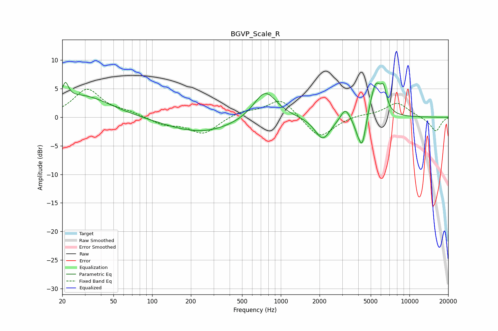

# BGVP_Scale_R
See [usage instructions](https://github.com/jaakkopasanen/AutoEq#usage) for more options and info.

### Parametric EQs
Apply preamp of -6.2 dB when using parametric equalizer.

|   # | Type    |   Fc (Hz) |    Q |   Gain (dB) |
|-----|---------|-----------|------|-------------|
|   1 | Peaking |        21 | 5.96 |         2.9 |
|   2 | Peaking |        29 | 0.67 |         3.8 |
|   3 | Peaking |       241 | 0.53 |        -2.7 |
|   4 | Peaking |       756 | 1.58 |         5.1 |
|   5 | Peaking |      2120 | 2.31 |        -4   |
|   6 | Peaking |      3170 | 4.02 |         2.1 |
|   7 | Peaking |      3953 | 4.65 |        -1.7 |
|   8 | Peaking |      4303 | 5.01 |        -5.1 |
|   9 | Peaking |      5456 | 3.27 |         5.9 |
|  10 | Peaking |      6293 | 5.75 |         3.3 |

### Fixed Band EQs
When using fixed band (also called graphic) equalizer, apply preamp of **-5.0 dB** (if available) and set gains manually with these parameters.

|   # | Type    |   Fc (Hz) |    Q |   Gain (dB) |
|-----|---------|-----------|------|-------------|
|   1 | Peaking |        31 | 1.41 |         4.8 |
|   2 | Peaking |        62 | 1.41 |         0.7 |
|   3 | Peaking |       125 | 1.41 |        -1.2 |
|   4 | Peaking |       250 | 1.41 |        -2.9 |
|   5 | Peaking |       500 | 1.41 |         1   |
|   6 | Peaking |      1000 | 1.41 |         3.3 |
|   7 | Peaking |      2000 | 1.41 |        -3.8 |
|   8 | Peaking |      4000 | 1.41 |         0.4 |
|   9 | Peaking |      8000 | 1.41 |         2.6 |
|  10 | Peaking |     16000 | 1.41 |        -2.5 |

### Graphs

