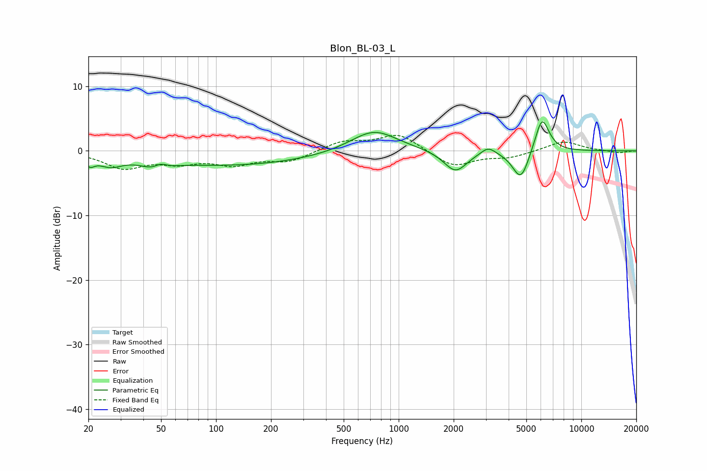

# Blon_BL-03_L
See [usage instructions](https://github.com/jaakkopasanen/AutoEq#usage) for more options and info.

### Parametric EQs
Apply preamp of -4.6 dB when using parametric equalizer.

|   # | Type    |   Fc (Hz) |    Q |   Gain (dB) |
|-----|---------|-----------|------|-------------|
|   1 | Peaking |        20 | 5.53 |        -1.3 |
|   2 | Peaking |        26 | 2.13 |        -1.6 |
|   3 | Peaking |        48 | 2.17 |        -2   |
|   4 | Peaking |        49 | 3.57 |         1.5 |
|   5 | Peaking |       124 | 0.32 |        -2.2 |
|   6 | Peaking |       730 | 1.1  |         3.5 |
|   7 | Peaking |      2045 | 2.22 |        -3.3 |
|   8 | Peaking |      3091 | 3.55 |         1.2 |
|   9 | Peaking |      4667 | 3.06 |        -4.7 |
|  10 | Peaking |      6090 | 3.48 |         5.6 |

### Fixed Band EQs
When using fixed band (also called graphic) equalizer, apply preamp of **-2.5 dB** (if available) and set gains manually with these parameters.

|   # | Type    |   Fc (Hz) |    Q |   Gain (dB) |
|-----|---------|-----------|------|-------------|
|   1 | Peaking |        31 | 1.41 |        -2.5 |
|   2 | Peaking |        62 | 1.41 |        -1.5 |
|   3 | Peaking |       125 | 1.41 |        -1.9 |
|   4 | Peaking |       250 | 1.41 |        -1.5 |
|   5 | Peaking |       500 | 1.41 |         1.5 |
|   6 | Peaking |      1000 | 1.41 |         2.6 |
|   7 | Peaking |      2000 | 1.41 |        -2.5 |
|   8 | Peaking |      4000 | 1.41 |        -0.9 |
|   9 | Peaking |      8000 | 1.41 |         1.5 |
|  10 | Peaking |     16000 | 1.41 |        -0.3 |

### Graphs

