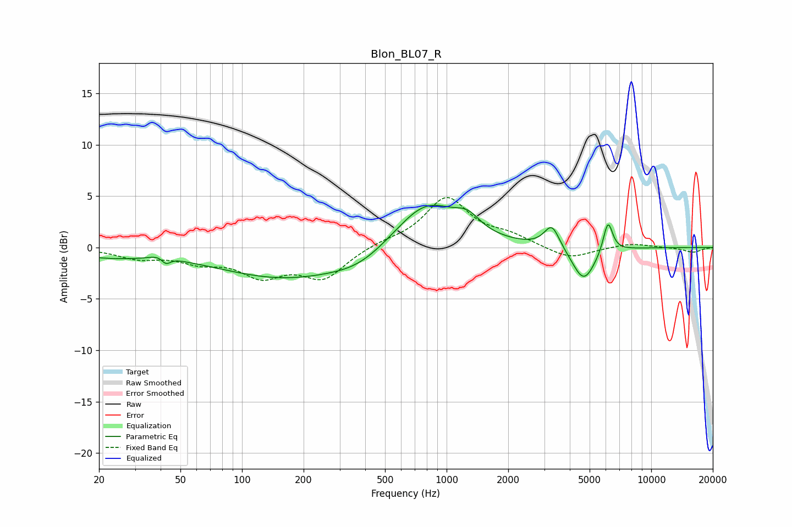

# Blon_BL07_R
See [usage instructions](https://github.com/jaakkopasanen/AutoEq#usage) for more options and info.

### Parametric EQs
Apply preamp of -4.2 dB when using parametric equalizer.

|   # | Type    |   Fc (Hz) |    Q |   Gain (dB) |
|-----|---------|-----------|------|-------------|
|   1 | Peaking |        22 | 0.68 |        -0.8 |
|   2 | Peaking |        41 | 2.88 |         0.7 |
|   3 | Peaking |        42 | 6    |        -0.9 |
|   4 | Peaking |       164 | 0.43 |        -2.9 |
|   5 | Peaking |       376 | 1.03 |        -1.1 |
|   6 | Peaking |       796 | 0.91 |         4.6 |
|   7 | Peaking |      1266 | 2.35 |         1.4 |
|   8 | Peaking |      3270 | 3.77 |         2.3 |
|   9 | Peaking |      4680 | 2.48 |        -3.4 |
|  10 | Peaking |      6147 | 6    |         3.1 |

### Fixed Band EQs
When using fixed band (also called graphic) equalizer, apply preamp of **-5.0 dB** (if available) and set gains manually with these parameters.

|   # | Type    |   Fc (Hz) |    Q |   Gain (dB) |
|-----|---------|-----------|------|-------------|
|   1 | Peaking |        31 | 1.41 |        -0.9 |
|   2 | Peaking |        62 | 1.41 |        -1.2 |
|   3 | Peaking |       125 | 1.41 |        -2.5 |
|   4 | Peaking |       250 | 1.41 |        -2.9 |
|   5 | Peaking |       500 | 1.41 |         0.5 |
|   6 | Peaking |      1000 | 1.41 |         4.8 |
|   7 | Peaking |      2000 | 1.41 |         1   |
|   8 | Peaking |      4000 | 1.41 |        -1.2 |
|   9 | Peaking |      8000 | 1.41 |         0.4 |
|  10 | Peaking |     16000 | 1.41 |        -0.5 |

### Graphs

