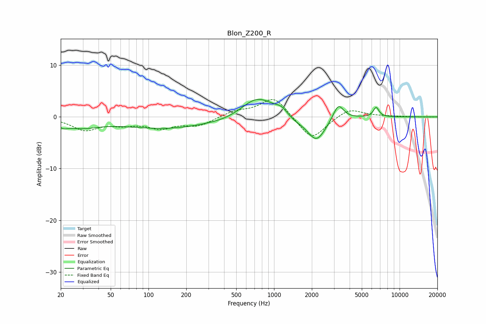

# Blon_Z200_R
See [usage instructions](https://github.com/jaakkopasanen/AutoEq#usage) for more options and info.

### Parametric EQs
Apply preamp of -3.5 dB when using parametric equalizer.

|   # | Type    |   Fc (Hz) |    Q |   Gain (dB) |
|-----|---------|-----------|------|-------------|
|   1 | Peaking |        21 | 4.22 |        -0.7 |
|   2 | Peaking |        28 | 0.93 |        -1.7 |
|   3 | Peaking |       138 | 0.42 |        -2.2 |
|   4 | Peaking |       455 | 0.91 |        -0.7 |
|   5 | Peaking |       734 | 1.03 |         4.3 |
|   6 | Peaking |      1148 | 3.09 |         1   |
|   7 | Peaking |      1466 | 1.95 |        -0.8 |
|   8 | Peaking |      2175 | 1.91 |        -4.8 |
|   9 | Peaking |      3252 | 3.39 |         3.1 |
|  10 | Peaking |      6504 | 6    |         1.9 |

### Fixed Band EQs
When using fixed band (also called graphic) equalizer, apply preamp of **-3.4 dB** (if available) and set gains manually with these parameters.

|   # | Type    |   Fc (Hz) |    Q |   Gain (dB) |
|-----|---------|-----------|------|-------------|
|   1 | Peaking |        31 | 1.41 |        -2.4 |
|   2 | Peaking |        62 | 1.41 |        -1.1 |
|   3 | Peaking |       125 | 1.41 |        -2   |
|   4 | Peaking |       250 | 1.41 |        -1.6 |
|   5 | Peaking |       500 | 1.41 |         1   |
|   6 | Peaking |      1000 | 1.41 |         4   |
|   7 | Peaking |      2000 | 1.41 |        -4.6 |
|   8 | Peaking |      4000 | 1.41 |         1.8 |
|   9 | Peaking |      8000 | 1.41 |         0.1 |
|  10 | Peaking |     16000 | 1.41 |        -0   |

### Graphs

