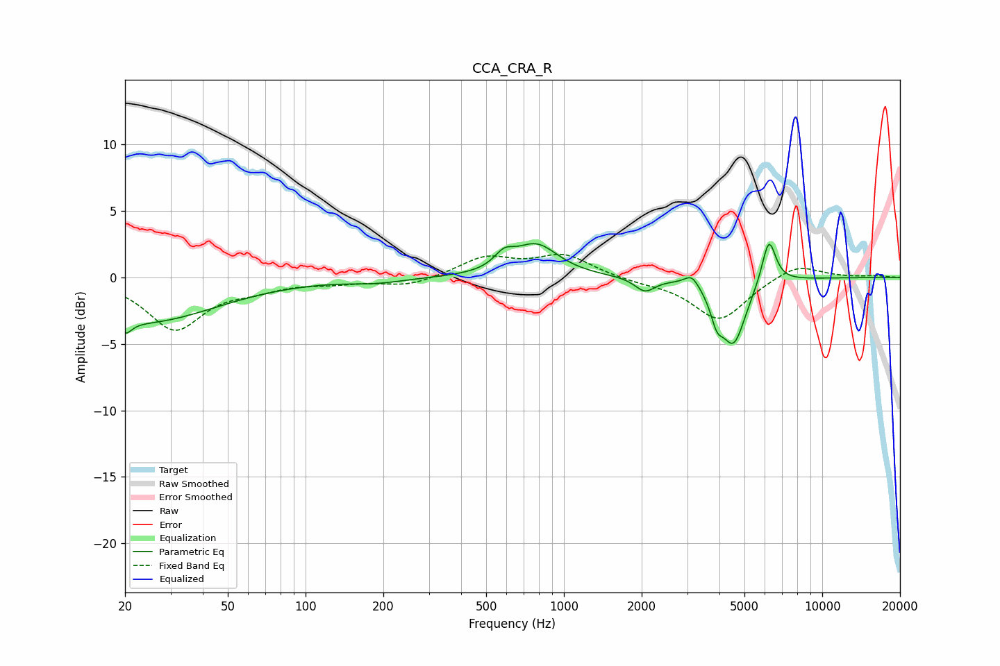

# CCA_CRA_R
See [usage instructions](https://github.com/jaakkopasanen/AutoEq#usage) for more options and info.

### Parametric EQs
Apply preamp of -2.6 dB when using parametric equalizer.

|   # | Type    |   Fc (Hz) |    Q |   Gain (dB) |
|-----|---------|-----------|------|-------------|
|   1 | Peaking |        20 | 5.58 |        -1   |
|   2 | Peaking |        24 | 0.51 |        -3.3 |
|   3 | Peaking |       189 | 1.34 |        -0.3 |
|   4 | Peaking |       587 | 3.72 |         1   |
|   5 | Peaking |       782 | 1.66 |         2.4 |
|   6 | Peaking |      2060 | 3.64 |        -1   |
|   7 | Peaking |      3126 | 5.07 |         0.9 |
|   8 | Peaking |      3907 | 5.92 |        -1.8 |
|   9 | Peaking |      4537 | 2.93 |        -4.8 |
|  10 | Peaking |      6216 | 5.12 |         3.4 |

### Fixed Band EQs
When using fixed band (also called graphic) equalizer, apply preamp of **-1.8 dB** (if available) and set gains manually with these parameters.

|   # | Type    |   Fc (Hz) |    Q |   Gain (dB) |
|-----|---------|-----------|------|-------------|
|   1 | Peaking |        31 | 1.41 |        -3.8 |
|   2 | Peaking |        62 | 1.41 |        -0.7 |
|   3 | Peaking |       125 | 1.41 |        -0.3 |
|   4 | Peaking |       250 | 1.41 |        -0.7 |
|   5 | Peaking |       500 | 1.41 |         1.5 |
|   6 | Peaking |      1000 | 1.41 |         1.6 |
|   7 | Peaking |      2000 | 1.41 |        -0.3 |
|   8 | Peaking |      4000 | 1.41 |        -3.2 |
|   9 | Peaking |      8000 | 1.41 |         1.1 |
|  10 | Peaking |     16000 | 1.41 |         0.1 |

### Graphs

