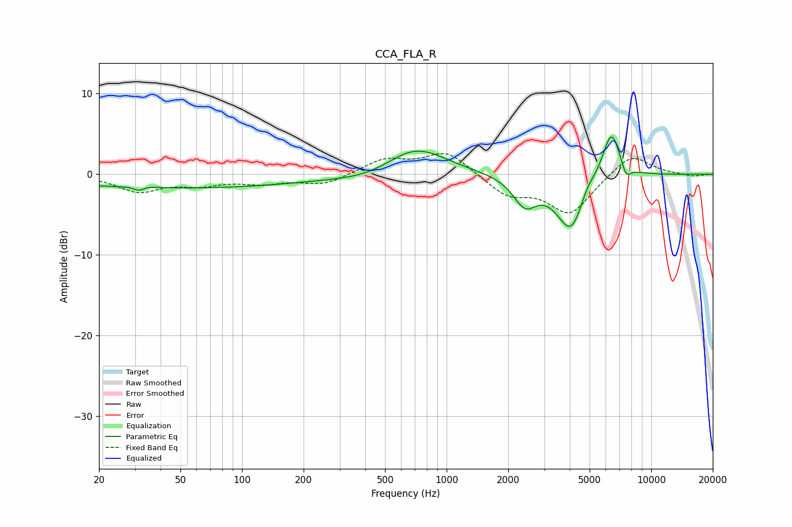

# CCA_FLA_R
See [usage instructions](https://github.com/jaakkopasanen/AutoEq#usage) for more options and info.

### Parametric EQs
Apply preamp of -4.7 dB when using parametric equalizer.

|   # | Type    |   Fc (Hz) |    Q |   Gain (dB) |
|-----|---------|-----------|------|-------------|
|   1 | Peaking |        32 | 4.43 |        -1.9 |
|   2 | Peaking |        32 | 3.65 |         1.6 |
|   3 | Peaking |        48 | 0.22 |        -1.7 |
|   4 | Peaking |       440 | 0.81 |        -1.1 |
|   5 | Peaking |       700 | 0.94 |         3.8 |
|   6 | Peaking |      2414 | 2.46 |        -3.4 |
|   7 | Peaking |      4080 | 1.91 |        -7.3 |
|   8 | Peaking |      4849 | 3.49 |         1.6 |
|   9 | Peaking |      6384 | 2.97 |         6.3 |
|  10 | Peaking |      7528 | 5.67 |        -1.7 |

### Fixed Band EQs
When using fixed band (also called graphic) equalizer, apply preamp of **-2.7 dB** (if available) and set gains manually with these parameters.

|   # | Type    |   Fc (Hz) |    Q |   Gain (dB) |
|-----|---------|-----------|------|-------------|
|   1 | Peaking |        31 | 1.41 |        -2   |
|   2 | Peaking |        62 | 1.41 |        -1.1 |
|   3 | Peaking |       125 | 1.41 |        -1   |
|   4 | Peaking |       250 | 1.41 |        -1.3 |
|   5 | Peaking |       500 | 1.41 |         1.8 |
|   6 | Peaking |      1000 | 1.41 |         2.8 |
|   7 | Peaking |      2000 | 1.41 |        -2.5 |
|   8 | Peaking |      4000 | 1.41 |        -4.8 |
|   9 | Peaking |      8000 | 1.41 |         2.7 |
|  10 | Peaking |     16000 | 1.41 |        -0.3 |

### Graphs

