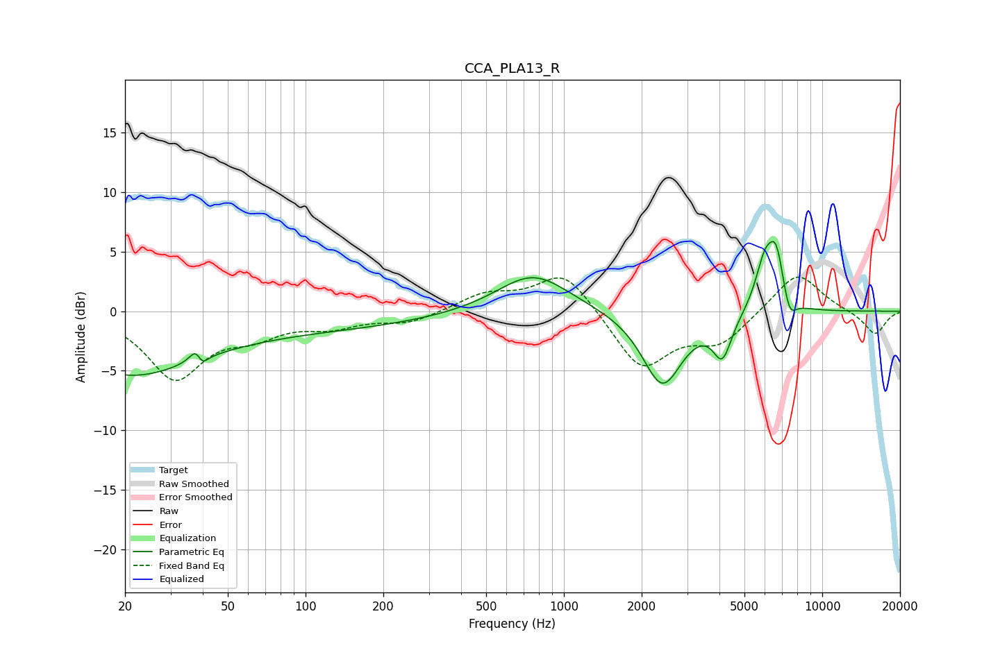

# CCA_PLA13_R
See [usage instructions](https://github.com/jaakkopasanen/AutoEq#usage) for more options and info.

### Parametric EQs
Apply preamp of -5.9 dB when using parametric equalizer.

|   # | Type    |   Fc (Hz) |    Q |   Gain (dB) |
|-----|---------|-----------|------|-------------|
|   1 | Peaking |        20 | 0.55 |        -4.6 |
|   2 | Peaking |        38 | 5.78 |         3.3 |
|   3 | Peaking |        39 | 5.98 |        -3.1 |
|   4 | Peaking |        85 | 0.25 |        -1.5 |
|   5 | Peaking |       759 | 1.02 |         3.3 |
|   6 | Peaking |      2406 | 1.81 |        -6.3 |
|   7 | Peaking |      4106 | 3.92 |        -3.4 |
|   8 | Peaking |      6007 | 3.59 |         4.2 |
|   9 | Peaking |      6649 | 4.68 |         4   |
|  10 | Peaking |      7474 | 5.51 |        -1.8 |

### Fixed Band EQs
When using fixed band (also called graphic) equalizer, apply preamp of **-3.0 dB** (if available) and set gains manually with these parameters.

|   # | Type    |   Fc (Hz) |    Q |   Gain (dB) |
|-----|---------|-----------|------|-------------|
|   1 | Peaking |        31 | 1.41 |        -5.5 |
|   2 | Peaking |        62 | 1.41 |        -1.6 |
|   3 | Peaking |       125 | 1.41 |        -1.1 |
|   4 | Peaking |       250 | 1.41 |        -0.9 |
|   5 | Peaking |       500 | 1.41 |         1.4 |
|   6 | Peaking |      1000 | 1.41 |         3.5 |
|   7 | Peaking |      2000 | 1.41 |        -4.8 |
|   8 | Peaking |      4000 | 1.41 |        -2.5 |
|   9 | Peaking |      8000 | 1.41 |         3.4 |
|  10 | Peaking |     16000 | 1.41 |        -2   |

### Graphs

