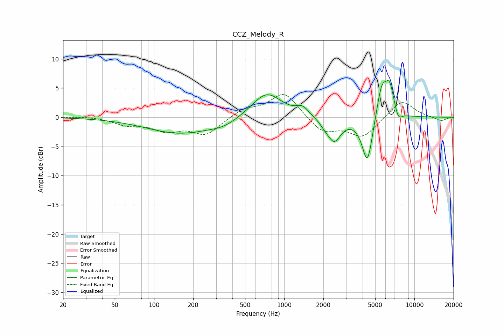

# CCZ_Melody_R
See [usage instructions](https://github.com/jaakkopasanen/AutoEq#usage) for more options and info.

### Parametric EQs
Apply preamp of -6.4 dB when using parametric equalizer.

|   # | Type    |   Fc (Hz) |    Q |   Gain (dB) |
|-----|---------|-----------|------|-------------|
|   1 | Peaking |       159 | 0.54 |        -2.7 |
|   2 | Peaking |       347 | 1.35 |        -0.9 |
|   3 | Peaking |       732 | 1.22 |         4.4 |
|   4 | Peaking |      1382 | 3.18 |         1.4 |
|   5 | Peaking |      2061 | 3.46 |        -0.8 |
|   6 | Peaking |      2428 | 2.8  |        -3.8 |
|   7 | Peaking |      4362 | 3.34 |        -8.4 |
|   8 | Peaking |      5614 | 3.26 |         5.9 |
|   9 | Peaking |      6464 | 4.07 |         4.6 |
|  10 | Peaking |      7516 | 4.82 |        -1.7 |

### Fixed Band EQs
When using fixed band (also called graphic) equalizer, apply preamp of **-4.0 dB** (if available) and set gains manually with these parameters.

|   # | Type    |   Fc (Hz) |    Q |   Gain (dB) |
|-----|---------|-----------|------|-------------|
|   1 | Peaking |        31 | 1.41 |         0.2 |
|   2 | Peaking |        62 | 1.41 |        -1.2 |
|   3 | Peaking |       125 | 1.41 |        -2   |
|   4 | Peaking |       250 | 1.41 |        -2.9 |
|   5 | Peaking |       500 | 1.41 |         1.4 |
|   6 | Peaking |      1000 | 1.41 |         4.3 |
|   7 | Peaking |      2000 | 1.41 |        -2.7 |
|   8 | Peaking |      4000 | 1.41 |        -3.3 |
|   9 | Peaking |      8000 | 1.41 |         3   |
|  10 | Peaking |     16000 | 1.41 |        -0.7 |

### Graphs

