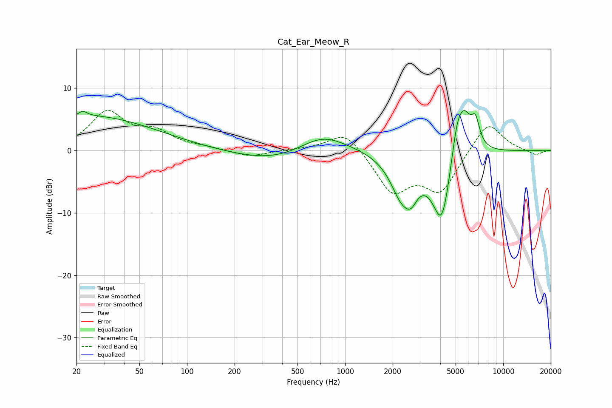

# Cat_Ear_Meow_R
See [usage instructions](https://github.com/jaakkopasanen/AutoEq#usage) for more options and info.

### Parametric EQs
Apply preamp of -6.5 dB when using parametric equalizer.

|   # | Type    |   Fc (Hz) |    Q |   Gain (dB) |
|-----|---------|-----------|------|-------------|
|   1 | Peaking |        22 | 5.32 |         0.8 |
|   2 | Peaking |        24 | 0.34 |         5.5 |
|   3 | Peaking |       371 | 0.55 |        -2   |
|   4 | Peaking |       719 | 0.91 |         3.2 |
|   5 | Peaking |      2266 | 1.96 |        -5.9 |
|   6 | Peaking |      2612 | 3.33 |        -3   |
|   7 | Peaking |      4093 | 2.18 |       -12   |
|   8 | Peaking |      5087 | 3.7  |         4.9 |
|   9 | Peaking |      5657 | 2.63 |         7   |
|  10 | Peaking |      6683 | 5.29 |         3.7 |

### Fixed Band EQs
When using fixed band (also called graphic) equalizer, apply preamp of **-6.5 dB** (if available) and set gains manually with these parameters.

|   # | Type    |   Fc (Hz) |    Q |   Gain (dB) |
|-----|---------|-----------|------|-------------|
|   1 | Peaking |        31 | 1.41 |         5.9 |
|   2 | Peaking |        62 | 1.41 |         2.6 |
|   3 | Peaking |       125 | 1.41 |         0.4 |
|   4 | Peaking |       250 | 1.41 |        -1.1 |
|   5 | Peaking |       500 | 1.41 |         0.1 |
|   6 | Peaking |      1000 | 1.41 |         3.4 |
|   7 | Peaking |      2000 | 1.41 |        -6.5 |
|   8 | Peaking |      4000 | 1.41 |        -6.3 |
|   9 | Peaking |      8000 | 1.41 |         4.9 |
|  10 | Peaking |     16000 | 1.41 |        -0.8 |

### Graphs

