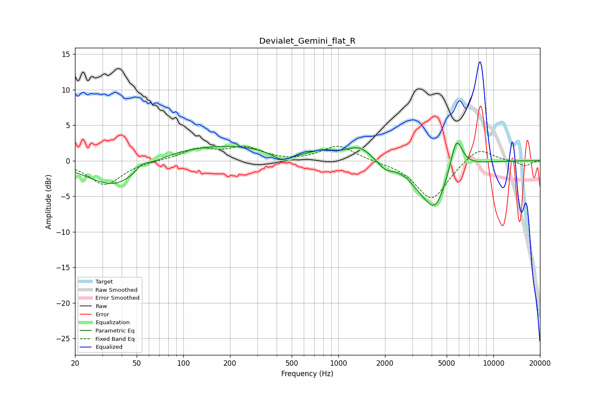

# Devialet_Gemini_flat_R
See [usage instructions](https://github.com/jaakkopasanen/AutoEq#usage) for more options and info.

### Parametric EQs
Apply preamp of -2.6 dB when using parametric equalizer.

|   # | Type    |   Fc (Hz) |    Q |   Gain (dB) |
|-----|---------|-----------|------|-------------|
|   1 | Peaking |        36 | 0.81 |        -4.2 |
|   2 | Peaking |        55 | 3.85 |         0.9 |
|   3 | Peaking |       155 | 0.3  |         2.3 |
|   4 | Peaking |       435 | 2.12 |        -1.4 |
|   5 | Peaking |       801 | 2.02 |         0.7 |
|   6 | Peaking |      1369 | 1.68 |         1.9 |
|   7 | Peaking |      2012 | 2.76 |        -1.2 |
|   8 | Peaking |      3336 | 1.69 |        -1.8 |
|   9 | Peaking |      4231 | 1.92 |        -5.8 |
|  10 | Peaking |      5778 | 3.52 |         4.8 |

### Fixed Band EQs
When using fixed band (also called graphic) equalizer, apply preamp of **-2.1 dB** (if available) and set gains manually with these parameters.

|   # | Type    |   Fc (Hz) |    Q |   Gain (dB) |
|-----|---------|-----------|------|-------------|
|   1 | Peaking |        31 | 1.41 |        -3.4 |
|   2 | Peaking |        62 | 1.41 |         0   |
|   3 | Peaking |       125 | 1.41 |         1.6 |
|   4 | Peaking |       250 | 1.41 |         1.7 |
|   5 | Peaking |       500 | 1.41 |        -0.2 |
|   6 | Peaking |      1000 | 1.41 |         2.2 |
|   7 | Peaking |      2000 | 1.41 |        -0.1 |
|   8 | Peaking |      4000 | 1.41 |        -5.5 |
|   9 | Peaking |      8000 | 1.41 |         2.1 |
|  10 | Peaking |     16000 | 1.41 |        -0.7 |

### Graphs

