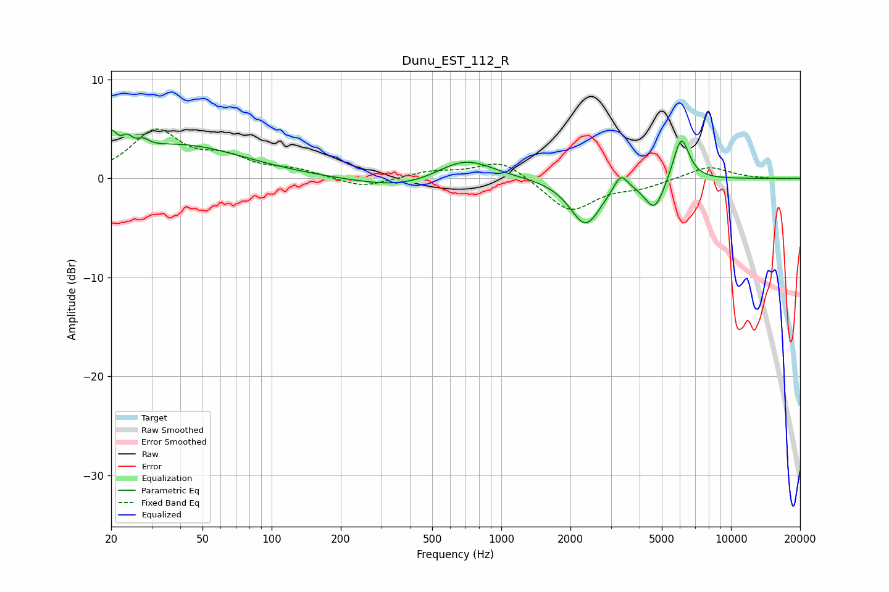

# Dunu_EST_112_R
See [usage instructions](https://github.com/jaakkopasanen/AutoEq#usage) for more options and info.

### Parametric EQs
Apply preamp of -5.0 dB when using parametric equalizer.

|   # | Type    |   Fc (Hz) |    Q |   Gain (dB) |
|-----|---------|-----------|------|-------------|
|   1 | Peaking |        20 | 5.83 |         2.3 |
|   2 | Peaking |        23 | 5.87 |         1.2 |
|   3 | Peaking |        28 | 5.45 |         0.7 |
|   4 | Peaking |        39 | 0.5  |         3.4 |
|   5 | Peaking |       381 | 0.71 |        -1.2 |
|   6 | Peaking |       691 | 1.14 |         2.4 |
|   7 | Peaking |      2328 | 2.1  |        -4.7 |
|   8 | Peaking |      3310 | 4.77 |         1.7 |
|   9 | Peaking |      4648 | 3.25 |        -3.2 |
|  10 | Peaking |      6069 | 3.9  |         4.6 |

### Fixed Band EQs
When using fixed band (also called graphic) equalizer, apply preamp of **-5.1 dB** (if available) and set gains manually with these parameters.

|   # | Type    |   Fc (Hz) |    Q |   Gain (dB) |
|-----|---------|-----------|------|-------------|
|   1 | Peaking |        31 | 1.41 |         4.6 |
|   2 | Peaking |        62 | 1.41 |         1.8 |
|   3 | Peaking |       125 | 1.41 |         0.8 |
|   4 | Peaking |       250 | 1.41 |        -1   |
|   5 | Peaking |       500 | 1.41 |         0.7 |
|   6 | Peaking |      1000 | 1.41 |         1.9 |
|   7 | Peaking |      2000 | 1.41 |        -3.4 |
|   8 | Peaking |      4000 | 1.41 |        -0.8 |
|   9 | Peaking |      8000 | 1.41 |         1.3 |
|  10 | Peaking |     16000 | 1.41 |        -0.1 |

### Graphs

