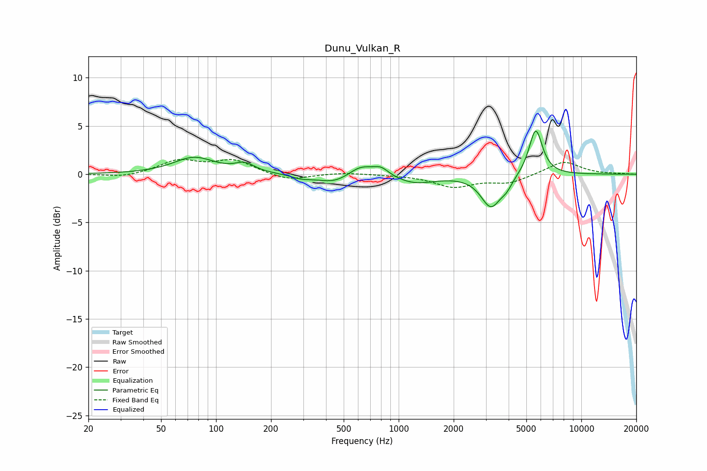

# Dunu_Vulkan_R
See [usage instructions](https://github.com/jaakkopasanen/AutoEq#usage) for more options and info.

### Parametric EQs
Apply preamp of -4.6 dB when using parametric equalizer.

|   # | Type    |   Fc (Hz) |    Q |   Gain (dB) |
|-----|---------|-----------|------|-------------|
|   1 | Peaking |        76 | 1.26 |         1.7 |
|   2 | Peaking |       144 | 2.69 |         0.9 |
|   3 | Peaking |       293 | 2.54 |        -0.4 |
|   4 | Peaking |       445 | 1.49 |        -1   |
|   5 | Peaking |       620 | 2.02 |         1.2 |
|   6 | Peaking |       801 | 3.28 |         0.8 |
|   7 | Peaking |      1229 | 1.28 |        -0.9 |
|   8 | Peaking |      3200 | 2.57 |        -3.3 |
|   9 | Peaking |      3898 | 4.36 |        -0.8 |
|  10 | Peaking |      5625 | 3.76 |         4.8 |

### Fixed Band EQs
When using fixed band (also called graphic) equalizer, apply preamp of **-1.6 dB** (if available) and set gains manually with these parameters.

|   # | Type    |   Fc (Hz) |    Q |   Gain (dB) |
|-----|---------|-----------|------|-------------|
|   1 | Peaking |        31 | 1.41 |        -0.4 |
|   2 | Peaking |        62 | 1.41 |         1.4 |
|   3 | Peaking |       125 | 1.41 |         1.4 |
|   4 | Peaking |       250 | 1.41 |        -0.7 |
|   5 | Peaking |       500 | 1.41 |         0.2 |
|   6 | Peaking |      1000 | 1.41 |        -0   |
|   7 | Peaking |      2000 | 1.41 |        -1.3 |
|   8 | Peaking |      4000 | 1.41 |        -0.9 |
|   9 | Peaking |      8000 | 1.41 |         1.4 |
|  10 | Peaking |     16000 | 1.41 |         0   |

### Graphs

