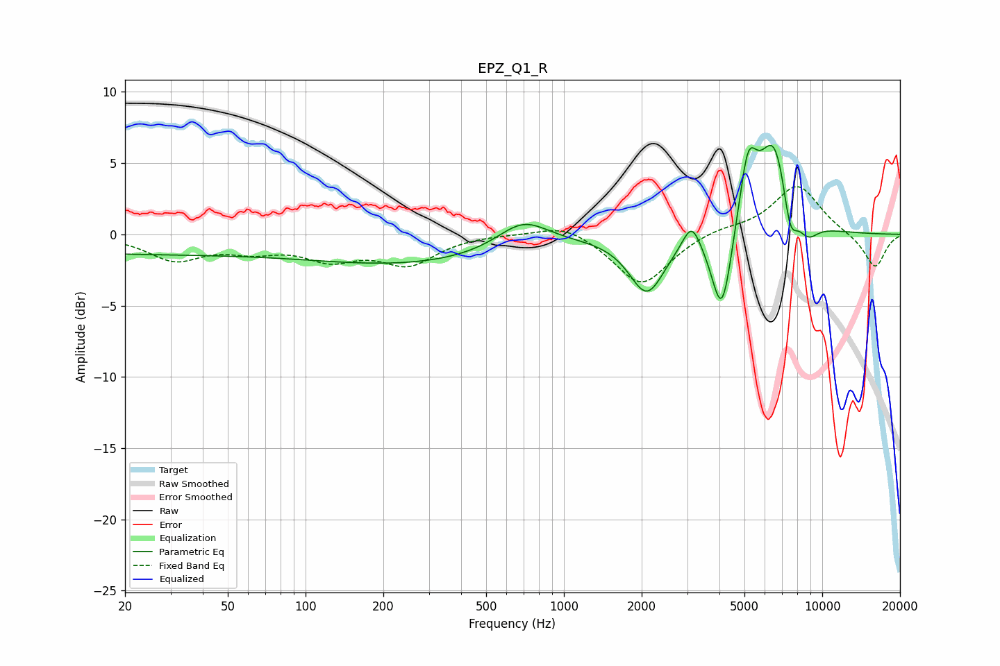

# EPZ_Q1_R
See [usage instructions](https://github.com/jaakkopasanen/AutoEq#usage) for more options and info.

### Parametric EQs
Apply preamp of -6.3 dB when using parametric equalizer.

|   # | Type    |   Fc (Hz) |    Q |   Gain (dB) |
|-----|---------|-----------|------|-------------|
|   1 | Peaking |        20 | 0.22 |        -1.3 |
|   2 | Peaking |       258 | 0.36 |        -1.9 |
|   3 | Peaking |       695 | 1.4  |         2   |
|   4 | Peaking |      2095 | 2.06 |        -4   |
|   5 | Peaking |      3121 | 4.11 |         1.9 |
|   6 | Peaking |      4091 | 3.49 |        -6.3 |
|   7 | Peaking |      5157 | 3.97 |         4.8 |
|   8 | Peaking |      6541 | 2.16 |         6.8 |
|   9 | Peaking |      7503 | 4.64 |        -3.2 |
|  10 | Peaking |      8762 | 3.05 |        -1.4 |

### Fixed Band EQs
When using fixed band (also called graphic) equalizer, apply preamp of **-3.4 dB** (if available) and set gains manually with these parameters.

|   # | Type    |   Fc (Hz) |    Q |   Gain (dB) |
|-----|---------|-----------|------|-------------|
|   1 | Peaking |        31 | 1.41 |        -1.7 |
|   2 | Peaking |        62 | 1.41 |        -0.9 |
|   3 | Peaking |       125 | 1.41 |        -1.5 |
|   4 | Peaking |       250 | 1.41 |        -2   |
|   5 | Peaking |       500 | 1.41 |         0.1 |
|   6 | Peaking |      1000 | 1.41 |         0.9 |
|   7 | Peaking |      2000 | 1.41 |        -3.6 |
|   8 | Peaking |      4000 | 1.41 |         0.4 |
|   9 | Peaking |      8000 | 1.41 |         3.5 |
|  10 | Peaking |     16000 | 1.41 |        -2.4 |

### Graphs

