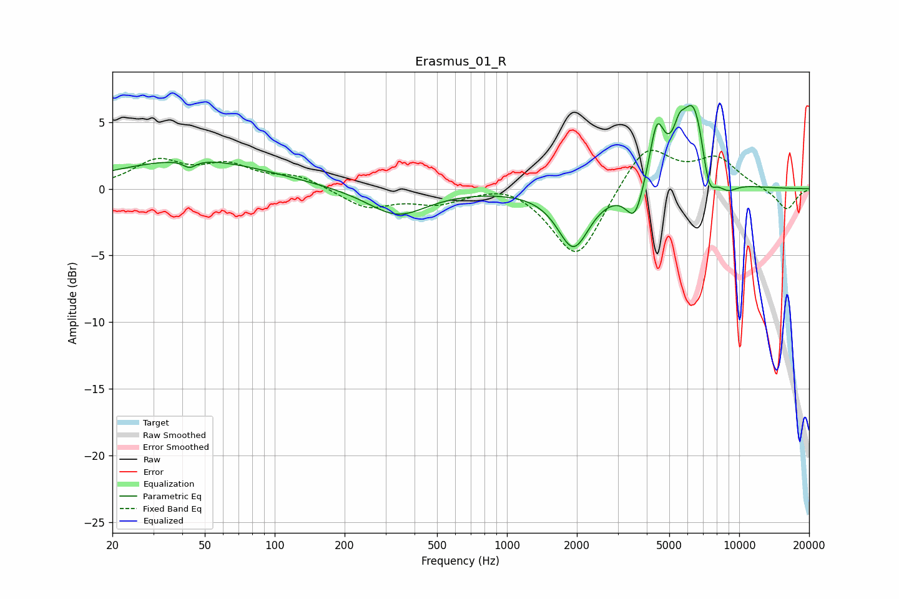

# Erasmus_01_R
See [usage instructions](https://github.com/jaakkopasanen/AutoEq#usage) for more options and info.

### Parametric EQs
Apply preamp of -6.3 dB when using parametric equalizer.

|   # | Type    |   Fc (Hz) |    Q |   Gain (dB) |
|-----|---------|-----------|------|-------------|
|   1 | Peaking |        43 | 5.24 |        -0.6 |
|   2 | Peaking |        44 | 0.43 |         2.2 |
|   3 | Peaking |       337 | 1.12 |        -2.1 |
|   4 | Peaking |      1935 | 2.07 |        -4.4 |
|   5 | Peaking |      3552 | 3.75 |        -2.6 |
|   6 | Peaking |      4421 | 4.46 |         4.2 |
|   7 | Peaking |      5519 | 5.92 |         1.4 |
|   8 | Peaking |      6400 | 2.32 |         6.9 |
|   9 | Peaking |      7381 | 4.12 |        -3.3 |
|  10 | Peaking |      8836 | 2.78 |        -1   |

### Fixed Band EQs
When using fixed band (also called graphic) equalizer, apply preamp of **-3.0 dB** (if available) and set gains manually with these parameters.

|   # | Type    |   Fc (Hz) |    Q |   Gain (dB) |
|-----|---------|-----------|------|-------------|
|   1 | Peaking |        31 | 1.41 |         2   |
|   2 | Peaking |        62 | 1.41 |         1.6 |
|   3 | Peaking |       125 | 1.41 |         0.9 |
|   4 | Peaking |       250 | 1.41 |        -1.4 |
|   5 | Peaking |       500 | 1.41 |        -1   |
|   6 | Peaking |      1000 | 1.41 |         0.6 |
|   7 | Peaking |      2000 | 1.41 |        -5.4 |
|   8 | Peaking |      4000 | 1.41 |         3.4 |
|   9 | Peaking |      8000 | 1.41 |         2.2 |
|  10 | Peaking |     16000 | 1.41 |        -1.6 |

### Graphs

