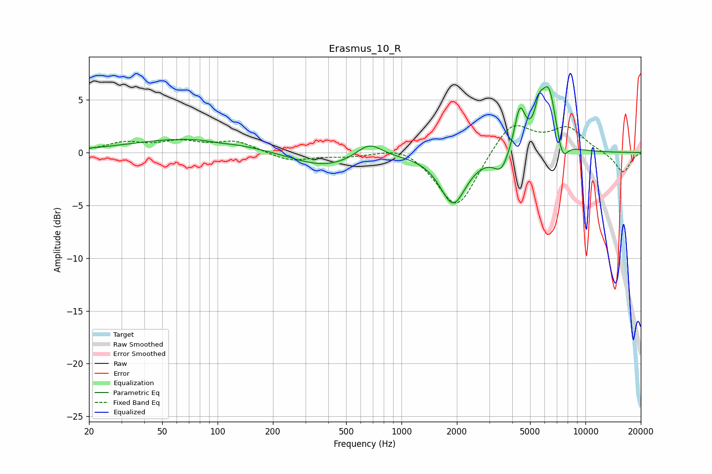

# Erasmus_10_R
See [usage instructions](https://github.com/jaakkopasanen/AutoEq#usage) for more options and info.

### Parametric EQs
Apply preamp of -6.3 dB when using parametric equalizer.

|   # | Type    |   Fc (Hz) |    Q |   Gain (dB) |
|-----|---------|-----------|------|-------------|
|   1 | Peaking |        71 | 0.45 |         1.3 |
|   2 | Peaking |       103 | 2.37 |        -0.1 |
|   3 | Peaking |       379 | 0.8  |        -1.4 |
|   4 | Peaking |       667 | 2.05 |         1.5 |
|   5 | Peaking |      1910 | 2.01 |        -4.8 |
|   6 | Peaking |      3487 | 3.51 |        -1.8 |
|   7 | Peaking |      4399 | 4.72 |         4   |
|   8 | Peaking |      5601 | 6    |         2.2 |
|   9 | Peaking |      6315 | 3.2  |         6   |
|  10 | Peaking |      7474 | 4.47 |        -2.3 |

### Fixed Band EQs
When using fixed band (also called graphic) equalizer, apply preamp of **-2.6 dB** (if available) and set gains manually with these parameters.

|   # | Type    |   Fc (Hz) |    Q |   Gain (dB) |
|-----|---------|-----------|------|-------------|
|   1 | Peaking |        31 | 1.41 |         0.9 |
|   2 | Peaking |        62 | 1.41 |         0.9 |
|   3 | Peaking |       125 | 1.41 |         1   |
|   4 | Peaking |       250 | 1.41 |        -0.8 |
|   5 | Peaking |       500 | 1.41 |        -0.3 |
|   6 | Peaking |      1000 | 1.41 |         0.8 |
|   7 | Peaking |      2000 | 1.41 |        -5.5 |
|   8 | Peaking |      4000 | 1.41 |         3.1 |
|   9 | Peaking |      8000 | 1.41 |         2.2 |
|  10 | Peaking |     16000 | 1.41 |        -1.9 |

### Graphs

