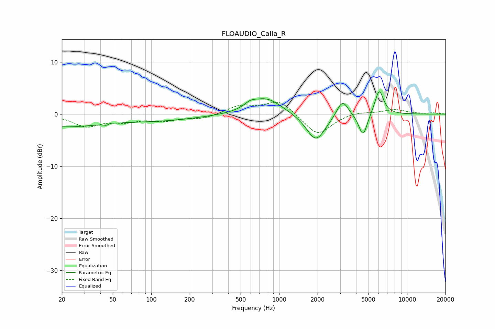

# FLOAUDIO_Calla_R
See [usage instructions](https://github.com/jaakkopasanen/AutoEq#usage) for more options and info.

### Parametric EQs
Apply preamp of -4.4 dB when using parametric equalizer.

|   # | Type    |   Fc (Hz) |    Q |   Gain (dB) |
|-----|---------|-----------|------|-------------|
|   1 | Peaking |        20 | 0.44 |        -2.3 |
|   2 | Peaking |        46 | 5.99 |        -2   |
|   3 | Peaking |        46 | 5.78 |         1.8 |
|   4 | Peaking |       121 | 0.46 |        -1.1 |
|   5 | Peaking |       595 | 2.93 |         0.9 |
|   6 | Peaking |       798 | 1.19 |         3.1 |
|   7 | Peaking |      1941 | 1.86 |        -5.3 |
|   8 | Peaking |      3128 | 3.13 |         3.3 |
|   9 | Peaking |      4532 | 4.17 |        -4.5 |
|  10 | Peaking |      6058 | 4    |         4.8 |

### Fixed Band EQs
When using fixed band (also called graphic) equalizer, apply preamp of **-2.4 dB** (if available) and set gains manually with these parameters.

|   # | Type    |   Fc (Hz) |    Q |   Gain (dB) |
|-----|---------|-----------|------|-------------|
|   1 | Peaking |        31 | 1.41 |        -2.2 |
|   2 | Peaking |        62 | 1.41 |        -1.2 |
|   3 | Peaking |       125 | 1.41 |        -1.1 |
|   4 | Peaking |       250 | 1.41 |        -0.8 |
|   5 | Peaking |       500 | 1.41 |         1.6 |
|   6 | Peaking |      1000 | 1.41 |         2.7 |
|   7 | Peaking |      2000 | 1.41 |        -4.1 |
|   8 | Peaking |      4000 | 1.41 |         0.5 |
|   9 | Peaking |      8000 | 1.41 |         0.9 |
|  10 | Peaking |     16000 | 1.41 |         0.2 |

### Graphs

