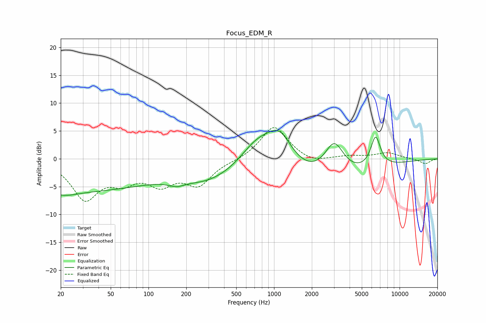

# Focus_EDM_R
See [usage instructions](https://github.com/jaakkopasanen/AutoEq#usage) for more options and info.

### Parametric EQs
Apply preamp of -5.2 dB when using parametric equalizer.

|   # | Type    |   Fc (Hz) |    Q |   Gain (dB) |
|-----|---------|-----------|------|-------------|
|   1 | Peaking |        22 | 1.51 |        -0.8 |
|   2 | Peaking |        25 | 0.18 |        -5.8 |
|   3 | Peaking |       144 | 0.36 |         0.1 |
|   4 | Peaking |       167 | 2.17 |        -0.9 |
|   5 | Peaking |       283 | 0.71 |        -2.3 |
|   6 | Peaking |       725 | 0.99 |         5.3 |
|   7 | Peaking |      1104 | 1.25 |         6.8 |
|   8 | Peaking |      1620 | 0.26 |        -5   |
|   9 | Peaking |      3014 | 1.81 |         6.1 |
|  10 | Peaking |      6436 | 3.46 |         5.6 |

### Fixed Band EQs
When using fixed band (also called graphic) equalizer, apply preamp of **-5.7 dB** (if available) and set gains manually with these parameters.

|   # | Type    |   Fc (Hz) |    Q |   Gain (dB) |
|-----|---------|-----------|------|-------------|
|   1 | Peaking |        31 | 1.41 |        -6.9 |
|   2 | Peaking |        62 | 1.41 |        -3.2 |
|   3 | Peaking |       125 | 1.41 |        -3.9 |
|   4 | Peaking |       250 | 1.41 |        -4.3 |
|   5 | Peaking |       500 | 1.41 |        -0.3 |
|   6 | Peaking |      1000 | 1.41 |         6   |
|   7 | Peaking |      2000 | 1.41 |        -0.9 |
|   8 | Peaking |      4000 | 1.41 |         0.4 |
|   9 | Peaking |      8000 | 1.41 |         1.1 |
|  10 | Peaking |     16000 | 1.41 |        -0.9 |

### Graphs

