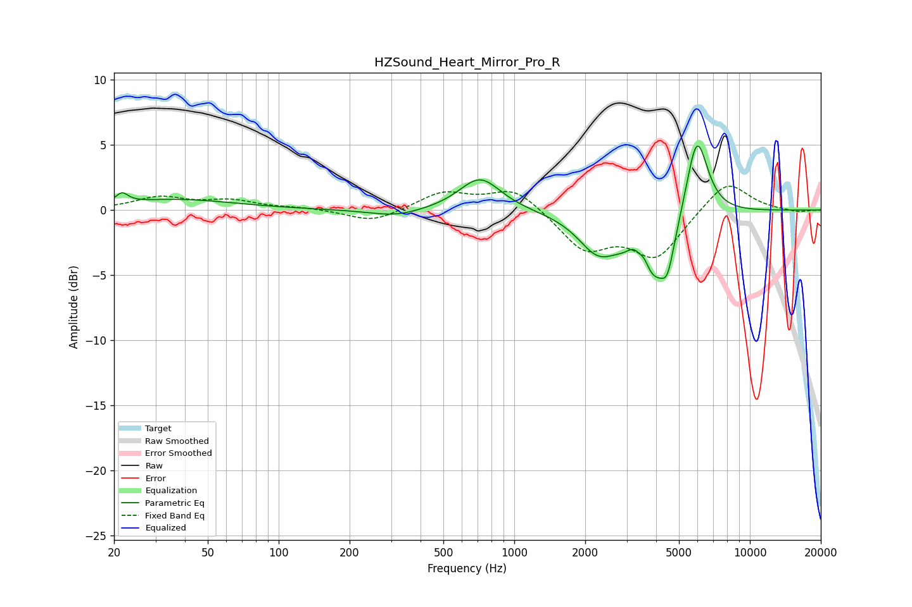

# HZSound_Heart_Mirror_Pro_R
See [usage instructions](https://github.com/jaakkopasanen/AutoEq#usage) for more options and info.

### Parametric EQs
Apply preamp of -5.0 dB when using parametric equalizer.

|   # | Type    |   Fc (Hz) |    Q |   Gain (dB) |
|-----|---------|-----------|------|-------------|
|   1 | Peaking |        22 | 5.55 |         0.8 |
|   2 | Peaking |        37 | 0.57 |         0.8 |
|   3 | Peaking |       314 | 1.26 |        -0.6 |
|   4 | Peaking |       715 | 1.62 |         2.6 |
|   5 | Peaking |      2257 | 1.7  |        -2.6 |
|   6 | Peaking |      3221 | 4.8  |         1.1 |
|   7 | Peaking |      3561 | 5.98 |         1.1 |
|   8 | Peaking |      3862 | 1.65 |        -5.4 |
|   9 | Peaking |      4475 | 5.27 |        -2.1 |
|  10 | Peaking |      5952 | 2.9  |         6.7 |

### Fixed Band EQs
When using fixed band (also called graphic) equalizer, apply preamp of **-1.9 dB** (if available) and set gains manually with these parameters.

|   # | Type    |   Fc (Hz) |    Q |   Gain (dB) |
|-----|---------|-----------|------|-------------|
|   1 | Peaking |        31 | 1.41 |         0.9 |
|   2 | Peaking |        62 | 1.41 |         0.7 |
|   3 | Peaking |       125 | 1.41 |         0.1 |
|   4 | Peaking |       250 | 1.41 |        -1   |
|   5 | Peaking |       500 | 1.41 |         1.3 |
|   6 | Peaking |      1000 | 1.41 |         1.7 |
|   7 | Peaking |      2000 | 1.41 |        -2.9 |
|   8 | Peaking |      4000 | 1.41 |        -3.5 |
|   9 | Peaking |      8000 | 1.41 |         2.4 |
|  10 | Peaking |     16000 | 1.41 |        -0.2 |

### Graphs

