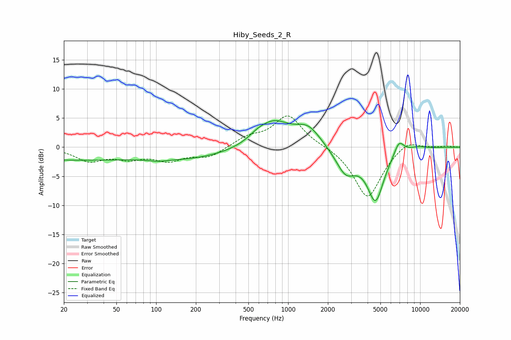

# Hiby_Seeds_2_R
See [usage instructions](https://github.com/jaakkopasanen/AutoEq#usage) for more options and info.

### Parametric EQs
Apply preamp of -4.7 dB when using parametric equalizer.

|   # | Type    |   Fc (Hz) |    Q |   Gain (dB) |
|-----|---------|-----------|------|-------------|
|   1 | Peaking |        20 | 0.27 |        -2.1 |
|   2 | Peaking |       103 | 2.39 |        -0.3 |
|   3 | Peaking |       181 | 0.43 |        -1.8 |
|   4 | Peaking |       580 | 2.39 |         0.6 |
|   5 | Peaking |       770 | 1.1  |         4.3 |
|   6 | Peaking |      1418 | 1.48 |         3.1 |
|   7 | Peaking |      2732 | 1.82 |        -4.3 |
|   8 | Peaking |      4594 | 2.17 |        -8.8 |
|   9 | Peaking |      6912 | 3.58 |         2.4 |
|  10 | Peaking |      9595 | 2.15 |         0.4 |

### Fixed Band EQs
When using fixed band (also called graphic) equalizer, apply preamp of **-5.5 dB** (if available) and set gains manually with these parameters.

|   # | Type    |   Fc (Hz) |    Q |   Gain (dB) |
|-----|---------|-----------|------|-------------|
|   1 | Peaking |        31 | 1.41 |        -2.2 |
|   2 | Peaking |        62 | 1.41 |        -1.6 |
|   3 | Peaking |       125 | 1.41 |        -2   |
|   4 | Peaking |       250 | 1.41 |        -1.6 |
|   5 | Peaking |       500 | 1.41 |         1.5 |
|   6 | Peaking |      1000 | 1.41 |         5.4 |
|   7 | Peaking |      2000 | 1.41 |         0.2 |
|   8 | Peaking |      4000 | 1.41 |        -8.8 |
|   9 | Peaking |      8000 | 1.41 |         1.6 |
|  10 | Peaking |     16000 | 1.41 |         0.2 |

### Graphs

