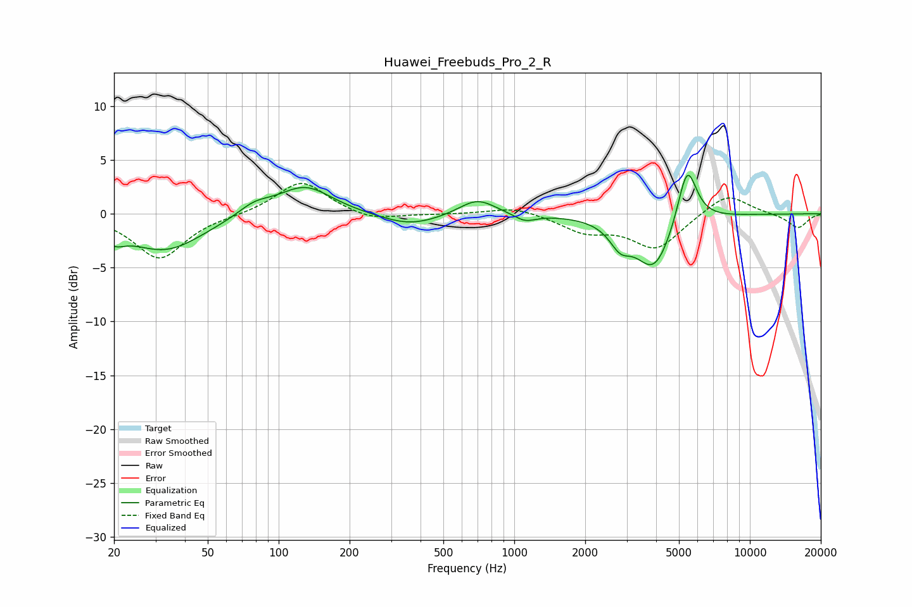

# Huawei_Freebuds_Pro_2_R
See [usage instructions](https://github.com/jaakkopasanen/AutoEq#usage) for more options and info.

### Parametric EQs
Apply preamp of -3.7 dB when using parametric equalizer.

|   # | Type    |   Fc (Hz) |    Q |   Gain (dB) |
|-----|---------|-----------|------|-------------|
|   1 | Peaking |        20 | 3.2  |        -1.2 |
|   2 | Peaking |        33 | 0.87 |        -3.4 |
|   3 | Peaking |        79 | 2    |         1   |
|   4 | Peaking |       129 | 1.23 |         2.7 |
|   5 | Peaking |       361 | 1.1  |        -1.2 |
|   6 | Peaking |       696 | 1.83 |         1.5 |
|   7 | Peaking |      1109 | 3.07 |        -0.7 |
|   8 | Peaking |      2816 | 3.14 |        -1.9 |
|   9 | Peaking |      3920 | 1.78 |        -5.1 |
|  10 | Peaking |      5416 | 3.4  |         5.6 |

### Fixed Band EQs
When using fixed band (also called graphic) equalizer, apply preamp of **-2.9 dB** (if available) and set gains manually with these parameters.

|   # | Type    |   Fc (Hz) |    Q |   Gain (dB) |
|-----|---------|-----------|------|-------------|
|   1 | Peaking |        31 | 1.41 |        -4.2 |
|   2 | Peaking |        62 | 1.41 |        -0.1 |
|   3 | Peaking |       125 | 1.41 |         3.1 |
|   4 | Peaking |       250 | 1.41 |        -0.7 |
|   5 | Peaking |       500 | 1.41 |        -0   |
|   6 | Peaking |      1000 | 1.41 |         0.7 |
|   7 | Peaking |      2000 | 1.41 |        -1.5 |
|   8 | Peaking |      4000 | 1.41 |        -3.2 |
|   9 | Peaking |      8000 | 1.41 |         2   |
|  10 | Peaking |     16000 | 1.41 |        -1.3 |

### Graphs

