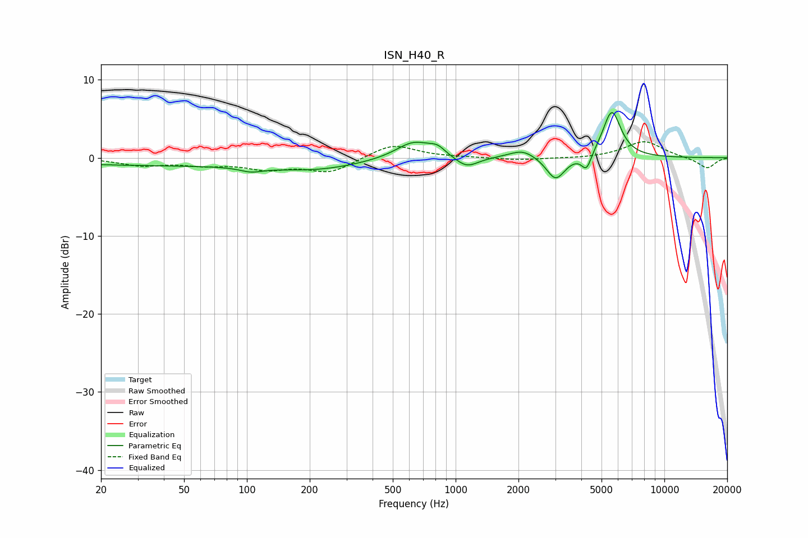

# ISN_H40_R
See [usage instructions](https://github.com/jaakkopasanen/AutoEq#usage) for more options and info.

### Parametric EQs
Apply preamp of -5.9 dB when using parametric equalizer.

|   # | Type    |   Fc (Hz) |    Q |   Gain (dB) |
|-----|---------|-----------|------|-------------|
|   1 | Peaking |        40 | 0.2  |        -0.9 |
|   2 | Peaking |       105 | 2.76 |        -0.6 |
|   3 | Peaking |       220 | 0.67 |        -1.1 |
|   4 | Peaking |       631 | 1.63 |         2.3 |
|   5 | Peaking |       818 | 3.74 |         0.9 |
|   6 | Peaking |      1130 | 2.57 |        -1.4 |
|   7 | Peaking |      2093 | 2.27 |         1.1 |
|   8 | Peaking |      3014 | 3.18 |        -3   |
|   9 | Peaking |      4237 | 6    |        -2.1 |
|  10 | Peaking |      5599 | 3.21 |         6   |

### Fixed Band EQs
When using fixed band (also called graphic) equalizer, apply preamp of **-2.1 dB** (if available) and set gains manually with these parameters.

|   # | Type    |   Fc (Hz) |    Q |   Gain (dB) |
|-----|---------|-----------|------|-------------|
|   1 | Peaking |        31 | 1.41 |        -0.9 |
|   2 | Peaking |        62 | 1.41 |        -0.8 |
|   3 | Peaking |       125 | 1.41 |        -1.3 |
|   4 | Peaking |       250 | 1.41 |        -1.8 |
|   5 | Peaking |       500 | 1.41 |         1.8 |
|   6 | Peaking |      1000 | 1.41 |         0   |
|   7 | Peaking |      2000 | 1.41 |        -0.3 |
|   8 | Peaking |      4000 | 1.41 |        -0.1 |
|   9 | Peaking |      8000 | 1.41 |         2.1 |
|  10 | Peaking |     16000 | 1.41 |        -1.4 |

### Graphs

