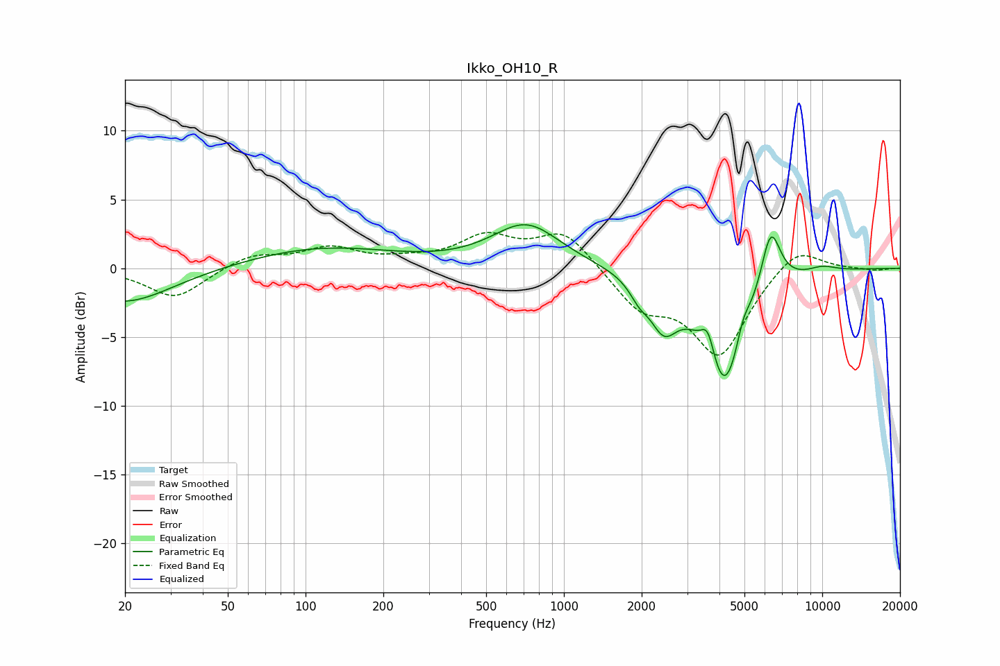

# Ikko_OH10_R
See [usage instructions](https://github.com/jaakkopasanen/AutoEq#usage) for more options and info.

### Parametric EQs
Apply preamp of -3.3 dB when using parametric equalizer.

|   # | Type    |   Fc (Hz) |    Q |   Gain (dB) |
|-----|---------|-----------|------|-------------|
|   1 | Peaking |        20 | 0.77 |        -2.6 |
|   2 | Peaking |       115 | 0.49 |         1.5 |
|   3 | Peaking |       715 | 1.07 |         3.2 |
|   4 | Peaking |      1955 | 3.84 |        -1   |
|   5 | Peaking |      2433 | 2.63 |        -3.2 |
|   6 | Peaking |      3614 | 5.16 |         2.3 |
|   7 | Peaking |      4177 | 1.69 |        -9   |
|   8 | Peaking |      4939 | 4.99 |         1.6 |
|   9 | Peaking |      6311 | 3.49 |         4.7 |
|  10 | Peaking |     10000 | 2.2  |         0.4 |

### Fixed Band EQs
When using fixed band (also called graphic) equalizer, apply preamp of **-2.7 dB** (if available) and set gains manually with these parameters.

|   # | Type    |   Fc (Hz) |    Q |   Gain (dB) |
|-----|---------|-----------|------|-------------|
|   1 | Peaking |        31 | 1.41 |        -2.2 |
|   2 | Peaking |        62 | 1.41 |         1   |
|   3 | Peaking |       125 | 1.41 |         1.4 |
|   4 | Peaking |       250 | 1.41 |         0.4 |
|   5 | Peaking |       500 | 1.41 |         2.1 |
|   6 | Peaking |      1000 | 1.41 |         2.7 |
|   7 | Peaking |      2000 | 1.41 |        -2.7 |
|   8 | Peaking |      4000 | 1.41 |        -6.2 |
|   9 | Peaking |      8000 | 1.41 |         1.8 |
|  10 | Peaking |     16000 | 1.41 |        -0.2 |

### Graphs

