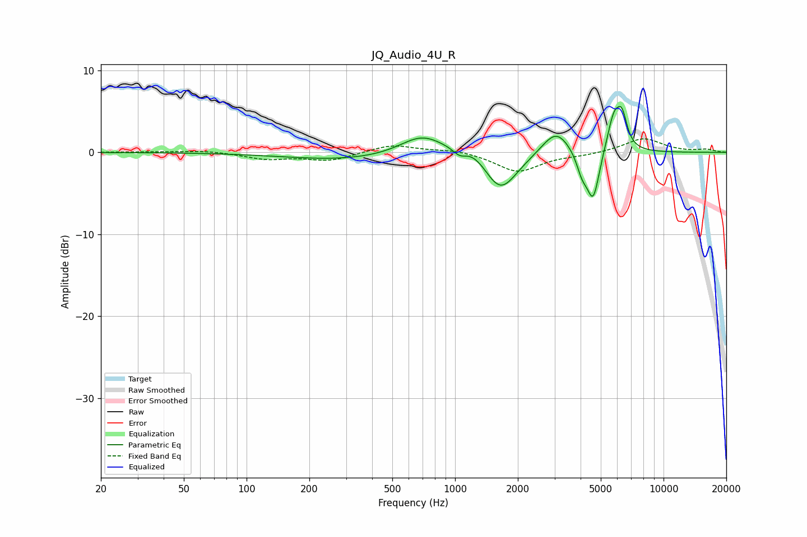

# JQ_Audio_4U_R
See [usage instructions](https://github.com/jaakkopasanen/AutoEq#usage) for more options and info.

### Parametric EQs
Apply preamp of -5.7 dB when using parametric equalizer.

|   # | Type    |   Fc (Hz) |    Q |   Gain (dB) |
|-----|---------|-----------|------|-------------|
|   1 | Peaking |       299 | 0.5  |        -0.9 |
|   2 | Peaking |       694 | 1.34 |         2.4 |
|   3 | Peaking |      1054 | 4.23 |        -1   |
|   4 | Peaking |      1233 | 1.68 |         1.6 |
|   5 | Peaking |      1643 | 1.72 |        -5.2 |
|   6 | Peaking |      3050 | 2.1  |         3.1 |
|   7 | Peaking |      4066 | 5.25 |        -2.2 |
|   8 | Peaking |      4598 | 4.61 |        -6   |
|   9 | Peaking |      5785 | 4.21 |         4.5 |
|  10 | Peaking |      6330 | 5.76 |         3.3 |

### Fixed Band EQs
When using fixed band (also called graphic) equalizer, apply preamp of **-1.8 dB** (if available) and set gains manually with these parameters.

|   # | Type    |   Fc (Hz) |    Q |   Gain (dB) |
|-----|---------|-----------|------|-------------|
|   1 | Peaking |        31 | 1.41 |         0.1 |
|   2 | Peaking |        62 | 1.41 |         0.2 |
|   3 | Peaking |       125 | 1.41 |        -0.8 |
|   4 | Peaking |       250 | 1.41 |        -1   |
|   5 | Peaking |       500 | 1.41 |         1   |
|   6 | Peaking |      1000 | 1.41 |         0.4 |
|   7 | Peaking |      2000 | 1.41 |        -2.4 |
|   8 | Peaking |      4000 | 1.41 |        -0.3 |
|   9 | Peaking |      8000 | 1.41 |         1.7 |
|  10 | Peaking |     16000 | 1.41 |         0.3 |

### Graphs

