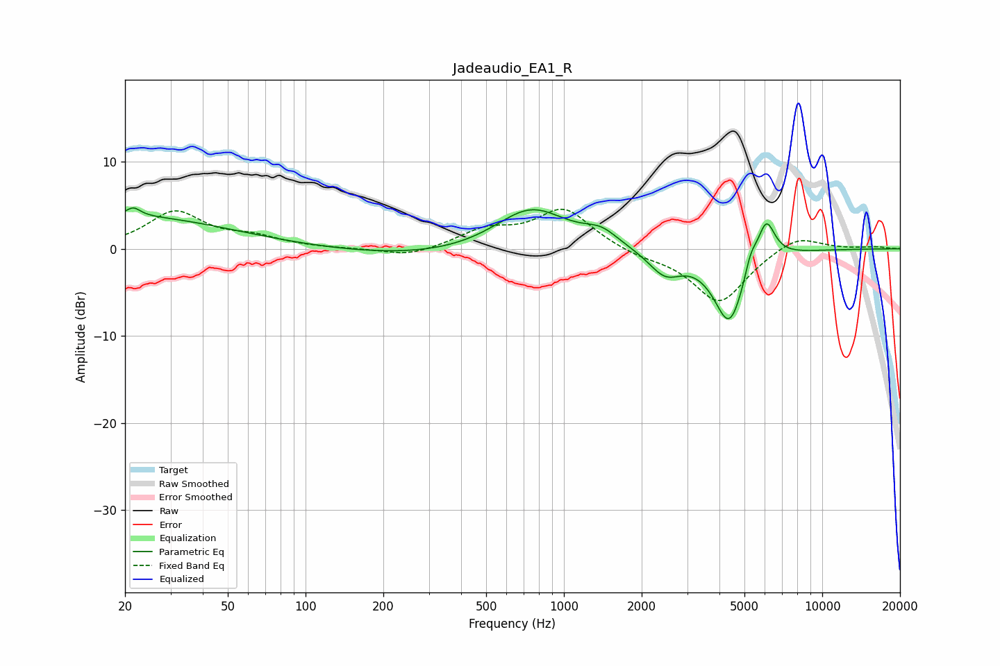

# Jadeaudio_EA1_R
See [usage instructions](https://github.com/jaakkopasanen/AutoEq#usage) for more options and info.

### Parametric EQs
Apply preamp of -4.8 dB when using parametric equalizer.

|   # | Type    |   Fc (Hz) |    Q |   Gain (dB) |
|-----|---------|-----------|------|-------------|
|   1 | Peaking |        20 | 0.35 |         3.7 |
|   2 | Peaking |        22 | 5.37 |         1   |
|   3 | Peaking |       437 | 0.32 |        -1.3 |
|   4 | Peaking |       747 | 0.96 |         5.5 |
|   5 | Peaking |      1288 | 5.06 |        -0   |
|   6 | Peaking |      1387 | 2.1  |         1.7 |
|   7 | Peaking |      2464 | 2.22 |        -2.7 |
|   8 | Peaking |      4371 | 2.28 |        -8.6 |
|   9 | Peaking |      5289 | 6    |         2.1 |
|  10 | Peaking |      6065 | 3.99 |         4.8 |

### Fixed Band EQs
When using fixed band (also called graphic) equalizer, apply preamp of **-4.6 dB** (if available) and set gains manually with these parameters.

|   # | Type    |   Fc (Hz) |    Q |   Gain (dB) |
|-----|---------|-----------|------|-------------|
|   1 | Peaking |        31 | 1.41 |         4.1 |
|   2 | Peaking |        62 | 1.41 |         1.1 |
|   3 | Peaking |       125 | 1.41 |        -0   |
|   4 | Peaking |       250 | 1.41 |        -1   |
|   5 | Peaking |       500 | 1.41 |         2   |
|   6 | Peaking |      1000 | 1.41 |         4.5 |
|   7 | Peaking |      2000 | 1.41 |        -0.7 |
|   8 | Peaking |      4000 | 1.41 |        -6.2 |
|   9 | Peaking |      8000 | 1.41 |         1.8 |
|  10 | Peaking |     16000 | 1.41 |         0.2 |

### Graphs

