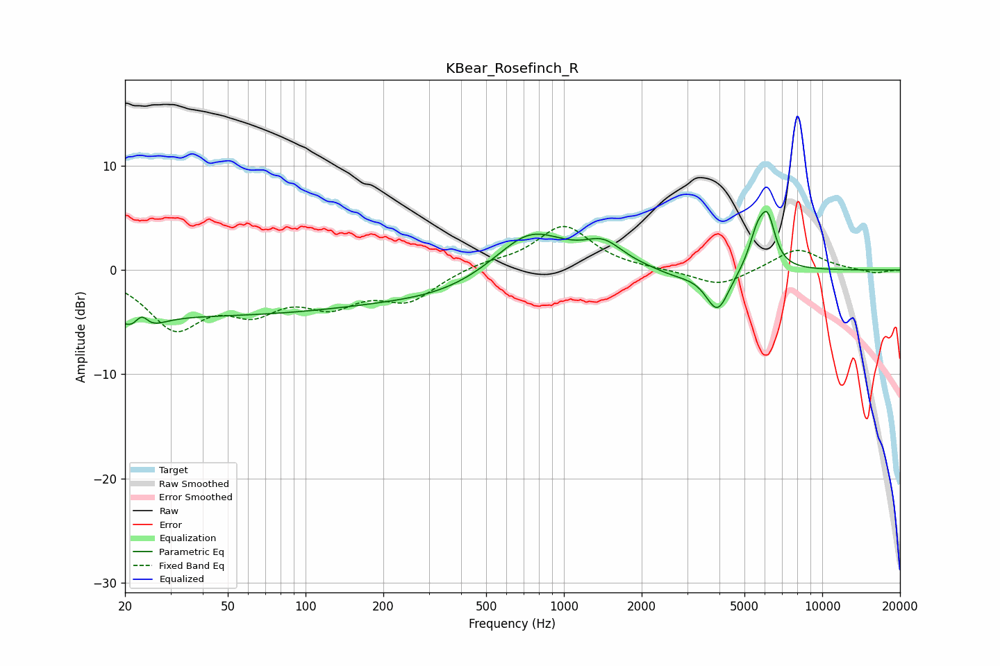

# KBear_Rosefinch_R
See [usage instructions](https://github.com/jaakkopasanen/AutoEq#usage) for more options and info.

### Parametric EQs
Apply preamp of -5.7 dB when using parametric equalizer.

|   # | Type    |   Fc (Hz) |    Q |   Gain (dB) |
|-----|---------|-----------|------|-------------|
|   1 | Peaking |        23 | 2.93 |        -4.5 |
|   2 | Peaking |        23 | 4.37 |         4   |
|   3 | Peaking |        39 | 0.18 |        -4.2 |
|   4 | Peaking |       352 | 0.59 |        -1.6 |
|   5 | Peaking |       737 | 1.03 |         4.3 |
|   6 | Peaking |      1424 | 1.88 |         2.1 |
|   7 | Peaking |      2694 | 1.69 |        -0.6 |
|   8 | Peaking |      3934 | 3.06 |        -4   |
|   9 | Peaking |      5615 | 4.17 |         3.2 |
|  10 | Peaking |      6162 | 4.78 |         4.1 |

### Fixed Band EQs
When using fixed band (also called graphic) equalizer, apply preamp of **-4.3 dB** (if available) and set gains manually with these parameters.

|   # | Type    |   Fc (Hz) |    Q |   Gain (dB) |
|-----|---------|-----------|------|-------------|
|   1 | Peaking |        31 | 1.41 |        -5.2 |
|   2 | Peaking |        62 | 1.41 |        -3.2 |
|   3 | Peaking |       125 | 1.41 |        -2.8 |
|   4 | Peaking |       250 | 1.41 |        -2.7 |
|   5 | Peaking |       500 | 1.41 |         0.6 |
|   6 | Peaking |      1000 | 1.41 |         4.2 |
|   7 | Peaking |      2000 | 1.41 |         0   |
|   8 | Peaking |      4000 | 1.41 |        -1.6 |
|   9 | Peaking |      8000 | 1.41 |         2.1 |
|  10 | Peaking |     16000 | 1.41 |        -0.3 |

### Graphs

