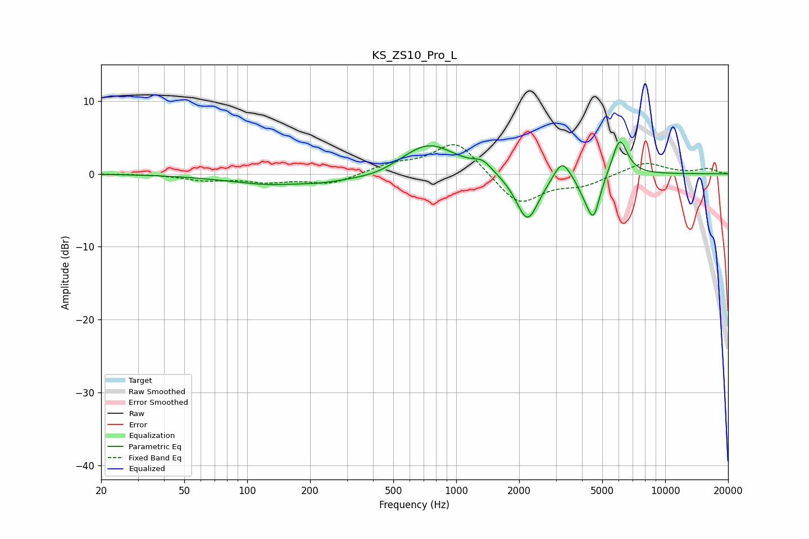

# KS_ZS10_Pro_L
See [usage instructions](https://github.com/jaakkopasanen/AutoEq#usage) for more options and info.

### Parametric EQs
Apply preamp of -4.5 dB when using parametric equalizer.

|   # | Type    |   Fc (Hz) |    Q |   Gain (dB) |
|-----|---------|-----------|------|-------------|
|   1 | Peaking |       165 | 0.55 |        -1.9 |
|   2 | Peaking |       167 | 1.71 |         0.3 |
|   3 | Peaking |       418 | 1.36 |        -0.6 |
|   4 | Peaking |       737 | 1.06 |         4.3 |
|   5 | Peaking |      1337 | 3.33 |         1.2 |
|   6 | Peaking |      2193 | 2.54 |        -6.7 |
|   7 | Peaking |      3214 | 3.55 |         2.9 |
|   8 | Peaking |      4123 | 3.69 |        -1.6 |
|   9 | Peaking |      4544 | 4.43 |        -5.5 |
|  10 | Peaking |      6068 | 3.77 |         5.1 |

### Fixed Band EQs
When using fixed band (also called graphic) equalizer, apply preamp of **-4.1 dB** (if available) and set gains manually with these parameters.

|   # | Type    |   Fc (Hz) |    Q |   Gain (dB) |
|-----|---------|-----------|------|-------------|
|   1 | Peaking |        31 | 1.41 |         0   |
|   2 | Peaking |        62 | 1.41 |        -0.8 |
|   3 | Peaking |       125 | 1.41 |        -1   |
|   4 | Peaking |       250 | 1.41 |        -1.4 |
|   5 | Peaking |       500 | 1.41 |         1.2 |
|   6 | Peaking |      1000 | 1.41 |         4.6 |
|   7 | Peaking |      2000 | 1.41 |        -4.4 |
|   8 | Peaking |      4000 | 1.41 |        -1.4 |
|   9 | Peaking |      8000 | 1.41 |         1.7 |
|  10 | Peaking |     16000 | 1.41 |         0.7 |

### Graphs

