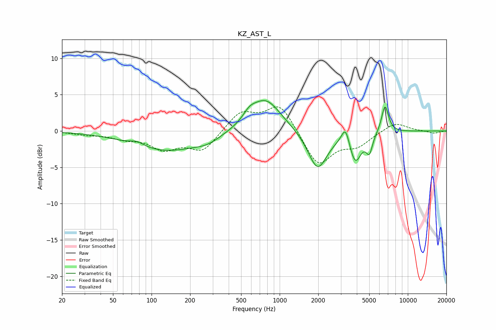

# KZ_AST_L
See [usage instructions](https://github.com/jaakkopasanen/AutoEq#usage) for more options and info.

### Parametric EQs
Apply preamp of -4.3 dB when using parametric equalizer.

|   # | Type    |   Fc (Hz) |    Q |   Gain (dB) |
|-----|---------|-----------|------|-------------|
|   1 | Peaking |        77 | 2.89 |         0.6 |
|   2 | Peaking |       130 | 0.52 |        -2.7 |
|   3 | Peaking |       273 | 1.46 |        -0.8 |
|   4 | Peaking |       581 | 2.86 |         1   |
|   5 | Peaking |       775 | 1.17 |         4.5 |
|   6 | Peaking |      1976 | 1.88 |        -5.4 |
|   7 | Peaking |      3265 | 4.56 |         2.6 |
|   8 | Peaking |      3886 | 3    |        -4.1 |
|   9 | Peaking |      5009 | 5.7  |        -2.4 |
|  10 | Peaking |      6638 | 4.96 |         3.8 |

### Fixed Band EQs
When using fixed band (also called graphic) equalizer, apply preamp of **-3.4 dB** (if available) and set gains manually with these parameters.

|   # | Type    |   Fc (Hz) |    Q |   Gain (dB) |
|-----|---------|-----------|------|-------------|
|   1 | Peaking |        31 | 1.41 |        -0.4 |
|   2 | Peaking |        62 | 1.41 |        -0.9 |
|   3 | Peaking |       125 | 1.41 |        -2.3 |
|   4 | Peaking |       250 | 1.41 |        -2.7 |
|   5 | Peaking |       500 | 1.41 |         2.6 |
|   6 | Peaking |      1000 | 1.41 |         3.8 |
|   7 | Peaking |      2000 | 1.41 |        -4.8 |
|   8 | Peaking |      4000 | 1.41 |        -1.8 |
|   9 | Peaking |      8000 | 1.41 |         1.3 |
|  10 | Peaking |     16000 | 1.41 |        -0.3 |

### Graphs

