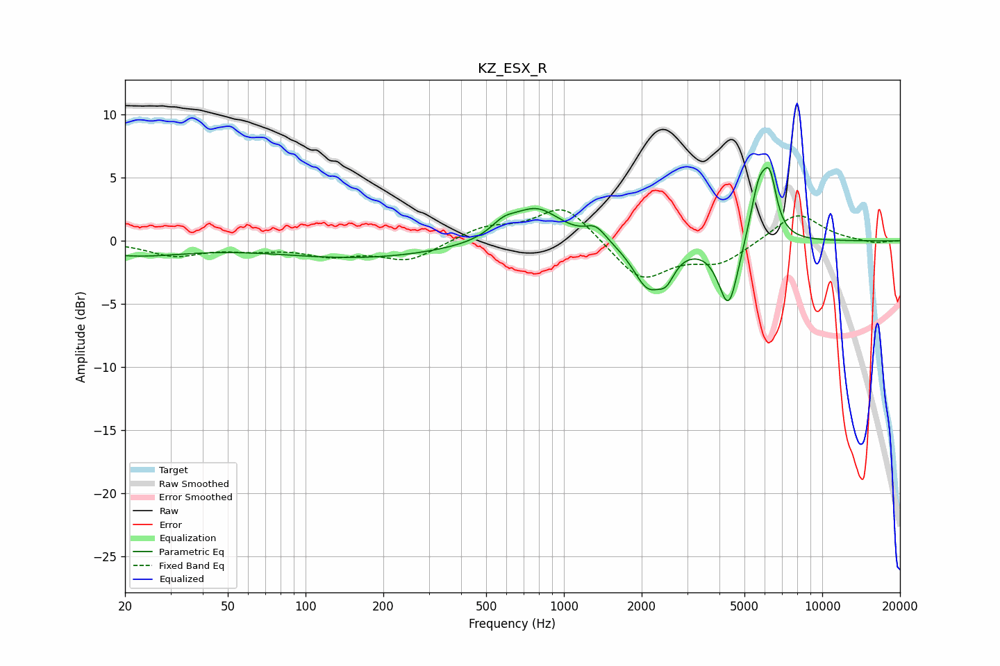

# KZ_ESX_R
See [usage instructions](https://github.com/jaakkopasanen/AutoEq#usage) for more options and info.

### Parametric EQs
Apply preamp of -5.9 dB when using parametric equalizer.

|   # | Type    |   Fc (Hz) |    Q |   Gain (dB) |
|-----|---------|-----------|------|-------------|
|   1 | Peaking |        22 | 0.68 |        -1.1 |
|   2 | Peaking |       166 | 0.41 |        -1.3 |
|   3 | Peaking |       584 | 2.82 |         1   |
|   4 | Peaking |       784 | 1.5  |         2.7 |
|   5 | Peaking |      1328 | 3.54 |         1.1 |
|   6 | Peaking |      2113 | 2.42 |        -3.5 |
|   7 | Peaking |      2494 | 4.49 |        -1.5 |
|   8 | Peaking |      4342 | 3.58 |        -5.4 |
|   9 | Peaking |      5693 | 3.85 |         4.5 |
|  10 | Peaking |      6279 | 5.31 |         3.6 |

### Fixed Band EQs
When using fixed band (also called graphic) equalizer, apply preamp of **-2.6 dB** (if available) and set gains manually with these parameters.

|   # | Type    |   Fc (Hz) |    Q |   Gain (dB) |
|-----|---------|-----------|------|-------------|
|   1 | Peaking |        31 | 1.41 |        -1.1 |
|   2 | Peaking |        62 | 1.41 |        -0.5 |
|   3 | Peaking |       125 | 1.41 |        -1   |
|   4 | Peaking |       250 | 1.41 |        -1.5 |
|   5 | Peaking |       500 | 1.41 |         1.1 |
|   6 | Peaking |      1000 | 1.41 |         2.9 |
|   7 | Peaking |      2000 | 1.41 |        -3.2 |
|   8 | Peaking |      4000 | 1.41 |        -1.7 |
|   9 | Peaking |      8000 | 1.41 |         2.3 |
|  10 | Peaking |     16000 | 1.41 |        -0.2 |

### Graphs

