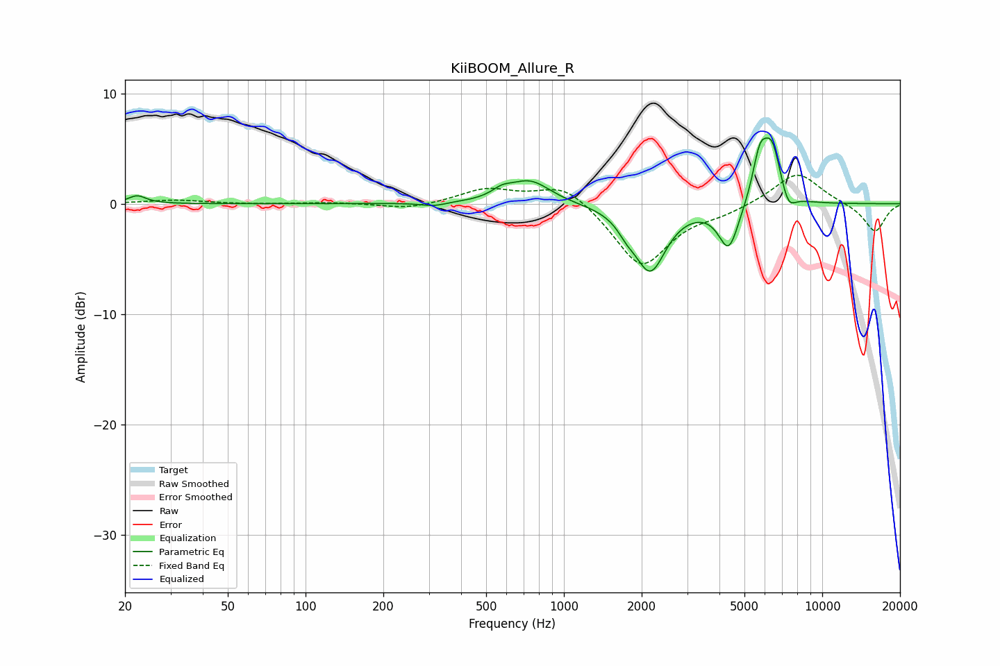

# KiiBOOM_Allure_R
See [usage instructions](https://github.com/jaakkopasanen/AutoEq#usage) for more options and info.

### Parametric EQs
Apply preamp of -6.1 dB when using parametric equalizer.

|   # | Type    |   Fc (Hz) |    Q |   Gain (dB) |
|-----|---------|-----------|------|-------------|
|   1 | Peaking |        22 | 4.25 |         0.7 |
|   2 | Peaking |       313 | 2.99 |        -0.3 |
|   3 | Peaking |       575 | 3.71 |         0.6 |
|   4 | Peaking |       737 | 1.75 |         2.1 |
|   5 | Peaking |      1747 | 4.12 |        -0.9 |
|   6 | Peaking |      2159 | 2.32 |        -5.9 |
|   7 | Peaking |      4346 | 3.57 |        -4.2 |
|   8 | Peaking |      5734 | 4.76 |         3.9 |
|   9 | Peaking |      6394 | 3.87 |         4.9 |
|  10 | Peaking |      7389 | 4.94 |        -1.6 |

### Fixed Band EQs
When using fixed band (also called graphic) equalizer, apply preamp of **-2.7 dB** (if available) and set gains manually with these parameters.

|   # | Type    |   Fc (Hz) |    Q |   Gain (dB) |
|-----|---------|-----------|------|-------------|
|   1 | Peaking |        31 | 1.41 |         0.3 |
|   2 | Peaking |        62 | 1.41 |        -0   |
|   3 | Peaking |       125 | 1.41 |         0.1 |
|   4 | Peaking |       250 | 1.41 |        -0.5 |
|   5 | Peaking |       500 | 1.41 |         1.3 |
|   6 | Peaking |      1000 | 1.41 |         2   |
|   7 | Peaking |      2000 | 1.41 |        -5.8 |
|   8 | Peaking |      4000 | 1.41 |        -0.7 |
|   9 | Peaking |      8000 | 1.41 |         3   |
|  10 | Peaking |     16000 | 1.41 |        -2.6 |

### Graphs

