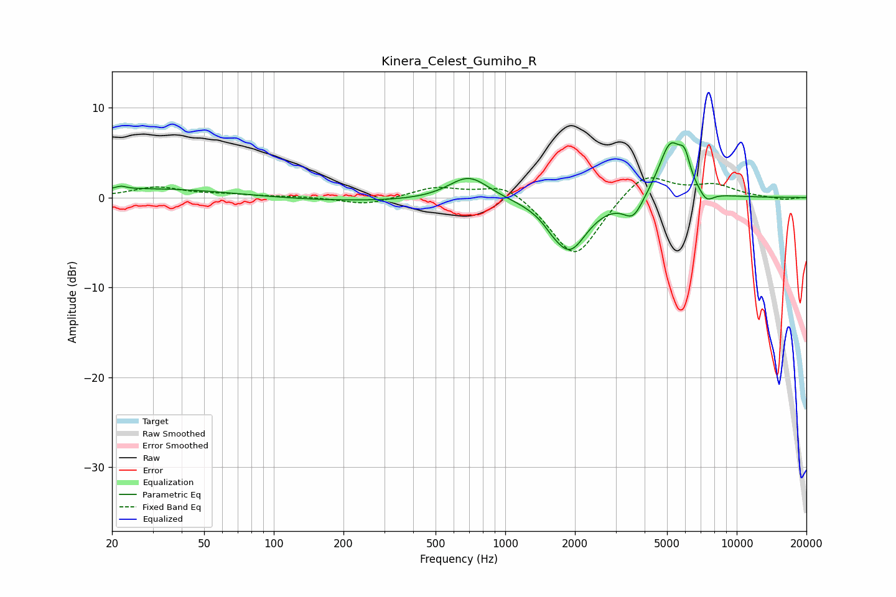

# Kinera_Celest_Gumiho_R
See [usage instructions](https://github.com/jaakkopasanen/AutoEq#usage) for more options and info.

### Parametric EQs
Apply preamp of -6.2 dB when using parametric equalizer.

|   # | Type    |   Fc (Hz) |    Q |   Gain (dB) |
|-----|---------|-----------|------|-------------|
|   1 | Peaking |        22 | 5.9  |         0.4 |
|   2 | Peaking |        31 | 0.4  |         1   |
|   3 | Peaking |       254 | 0.3  |        -0.5 |
|   4 | Peaking |       696 | 1.6  |         2.7 |
|   5 | Peaking |      1590 | 4.15 |        -0.4 |
|   6 | Peaking |      1893 | 1.84 |        -5.8 |
|   7 | Peaking |      3574 | 3.29 |        -2.3 |
|   8 | Peaking |      5173 | 2.62 |         6.1 |
|   9 | Peaking |      5958 | 5.92 |         2.4 |
|  10 | Peaking |      7393 | 4.3  |        -1.3 |

### Fixed Band EQs
When using fixed band (also called graphic) equalizer, apply preamp of **-2.3 dB** (if available) and set gains manually with these parameters.

|   # | Type    |   Fc (Hz) |    Q |   Gain (dB) |
|-----|---------|-----------|------|-------------|
|   1 | Peaking |        31 | 1.41 |         1.1 |
|   2 | Peaking |        62 | 1.41 |         0.3 |
|   3 | Peaking |       125 | 1.41 |         0.1 |
|   4 | Peaking |       250 | 1.41 |        -0.8 |
|   5 | Peaking |       500 | 1.41 |         1.1 |
|   6 | Peaking |      1000 | 1.41 |         1.8 |
|   7 | Peaking |      2000 | 1.41 |        -6.9 |
|   8 | Peaking |      4000 | 1.41 |         3.1 |
|   9 | Peaking |      8000 | 1.41 |         1.3 |
|  10 | Peaking |     16000 | 1.41 |        -0.3 |

### Graphs

