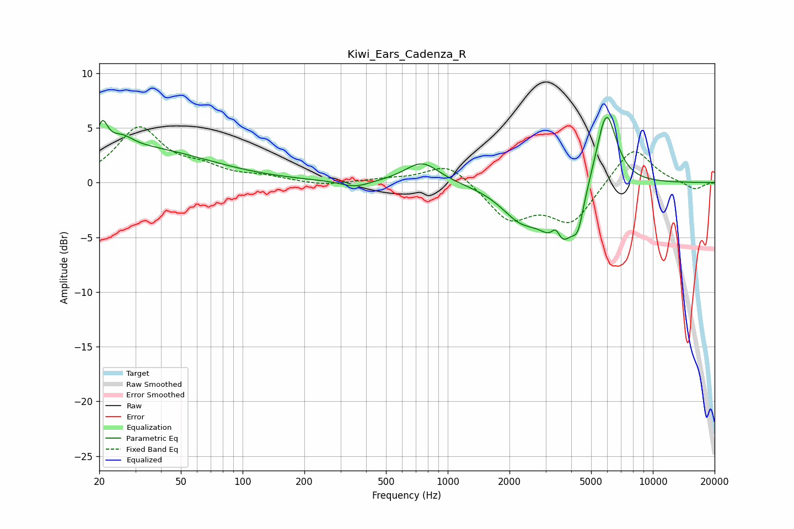

# Kiwi_Ears_Cadenza_R
See [usage instructions](https://github.com/jaakkopasanen/AutoEq#usage) for more options and info.

### Parametric EQs
Apply preamp of -6.0 dB when using parametric equalizer.

|   # | Type    |   Fc (Hz) |    Q |   Gain (dB) |
|-----|---------|-----------|------|-------------|
|   1 | Peaking |        21 | 5.64 |         2.4 |
|   2 | Peaking |        26 | 2.7  |         1   |
|   3 | Peaking |        30 | 0.41 |         3.1 |
|   4 | Peaking |       354 | 2.04 |        -0.6 |
|   5 | Peaking |       750 | 1.7  |         1.9 |
|   6 | Peaking |      2268 | 1.43 |        -2.8 |
|   7 | Peaking |      3366 | 5.99 |         1.8 |
|   8 | Peaking |      3526 | 1.96 |        -5.5 |
|   9 | Peaking |      4317 | 5.14 |        -2.4 |
|  10 | Peaking |      5924 | 2.7  |         7.2 |

### Fixed Band EQs
When using fixed band (also called graphic) equalizer, apply preamp of **-5.2 dB** (if available) and set gains manually with these parameters.

|   # | Type    |   Fc (Hz) |    Q |   Gain (dB) |
|-----|---------|-----------|------|-------------|
|   1 | Peaking |        31 | 1.41 |         4.9 |
|   2 | Peaking |        62 | 1.41 |         1.1 |
|   3 | Peaking |       125 | 1.41 |         0.4 |
|   4 | Peaking |       250 | 1.41 |        -0.3 |
|   5 | Peaking |       500 | 1.41 |         0.3 |
|   6 | Peaking |      1000 | 1.41 |         1.9 |
|   7 | Peaking |      2000 | 1.41 |        -3.3 |
|   8 | Peaking |      4000 | 1.41 |        -3.6 |
|   9 | Peaking |      8000 | 1.41 |         3.4 |
|  10 | Peaking |     16000 | 1.41 |        -0.7 |

### Graphs

