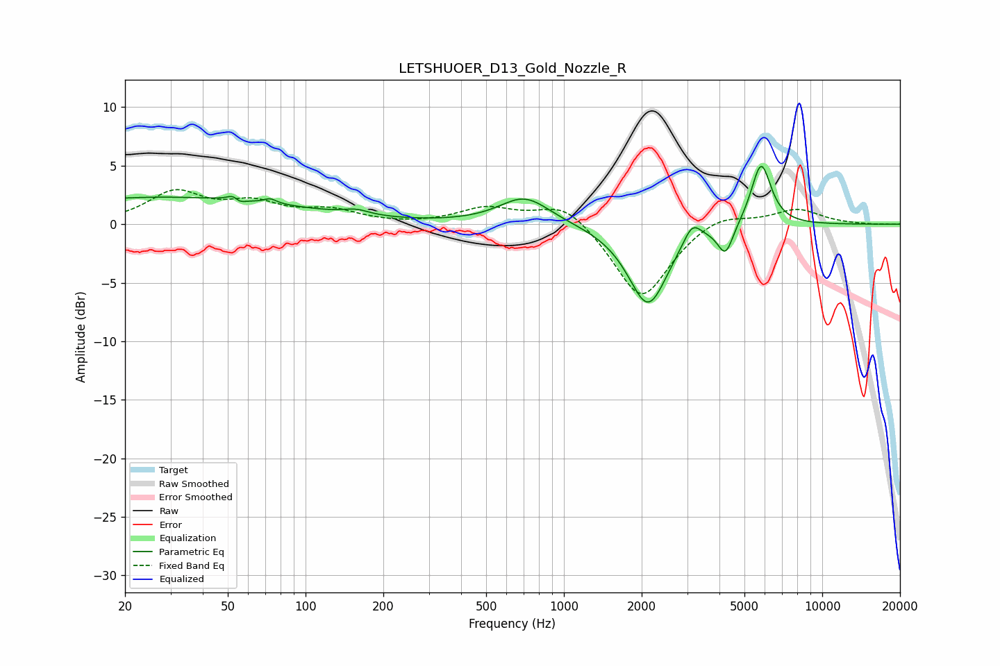

# LETSHUOER_D13_Gold_Nozzle_R
See [usage instructions](https://github.com/jaakkopasanen/AutoEq#usage) for more options and info.

### Parametric EQs
Apply preamp of -5.0 dB when using parametric equalizer.

|   # | Type    |   Fc (Hz) |    Q |   Gain (dB) |
|-----|---------|-----------|------|-------------|
|   1 | Peaking |        28 | 0.25 |         2.3 |
|   2 | Peaking |        53 | 6    |         1.9 |
|   3 | Peaking |        54 | 5.97 |        -1.8 |
|   4 | Peaking |        73 | 5.94 |         0.4 |
|   5 | Peaking |       157 | 2.86 |         0.4 |
|   6 | Peaking |       706 | 1.43 |         2.4 |
|   7 | Peaking |      2117 | 1.83 |        -7   |
|   8 | Peaking |      3137 | 4.05 |         1.8 |
|   9 | Peaking |      4223 | 4.71 |        -2.5 |
|  10 | Peaking |      5797 | 3.57 |         5.4 |

### Fixed Band EQs
When using fixed band (also called graphic) equalizer, apply preamp of **-3.1 dB** (if available) and set gains manually with these parameters.

|   # | Type    |   Fc (Hz) |    Q |   Gain (dB) |
|-----|---------|-----------|------|-------------|
|   1 | Peaking |        31 | 1.41 |         2.6 |
|   2 | Peaking |        62 | 1.41 |         1.6 |
|   3 | Peaking |       125 | 1.41 |         1   |
|   4 | Peaking |       250 | 1.41 |        -0.1 |
|   5 | Peaking |       500 | 1.41 |         1.3 |
|   6 | Peaking |      1000 | 1.41 |         2   |
|   7 | Peaking |      2000 | 1.41 |        -6.6 |
|   8 | Peaking |      4000 | 1.41 |         1.1 |
|   9 | Peaking |      8000 | 1.41 |         1.3 |
|  10 | Peaking |     16000 | 1.41 |        -0   |

### Graphs

