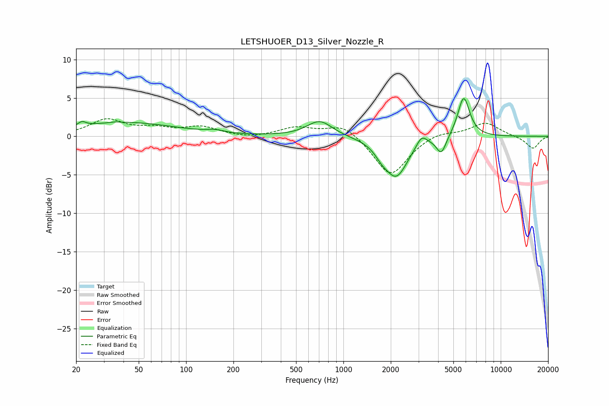

# LETSHUOER_D13_Silver_Nozzle_R
See [usage instructions](https://github.com/jaakkopasanen/AutoEq#usage) for more options and info.

### Parametric EQs
Apply preamp of -5.0 dB when using parametric equalizer.

|   # | Type    |   Fc (Hz) |    Q |   Gain (dB) |
|-----|---------|-----------|------|-------------|
|   1 | Peaking |        22 | 5.74 |         0.6 |
|   2 | Peaking |        35 | 5.94 |         0.1 |
|   3 | Peaking |        41 | 0.44 |         1.8 |
|   4 | Peaking |       153 | 2.74 |         0.3 |
|   5 | Peaking |       707 | 1.77 |         2.1 |
|   6 | Peaking |      1749 | 3.42 |        -0.9 |
|   7 | Peaking |      2164 | 1.9  |        -5.1 |
|   8 | Peaking |      3139 | 4.23 |         1.4 |
|   9 | Peaking |      4193 | 4.56 |        -2.3 |
|  10 | Peaking |      5814 | 3.64 |         5.3 |

### Fixed Band EQs
When using fixed band (also called graphic) equalizer, apply preamp of **-2.4 dB** (if available) and set gains manually with these parameters.

|   # | Type    |   Fc (Hz) |    Q |   Gain (dB) |
|-----|---------|-----------|------|-------------|
|   1 | Peaking |        31 | 1.41 |         2.1 |
|   2 | Peaking |        62 | 1.41 |         0.8 |
|   3 | Peaking |       125 | 1.41 |         1.1 |
|   4 | Peaking |       250 | 1.41 |        -0.3 |
|   5 | Peaking |       500 | 1.41 |         1.1 |
|   6 | Peaking |      1000 | 1.41 |         1.7 |
|   7 | Peaking |      2000 | 1.41 |        -5.2 |
|   8 | Peaking |      4000 | 1.41 |         0.7 |
|   9 | Peaking |      8000 | 1.41 |         1.8 |
|  10 | Peaking |     16000 | 1.41 |        -1.6 |

### Graphs

