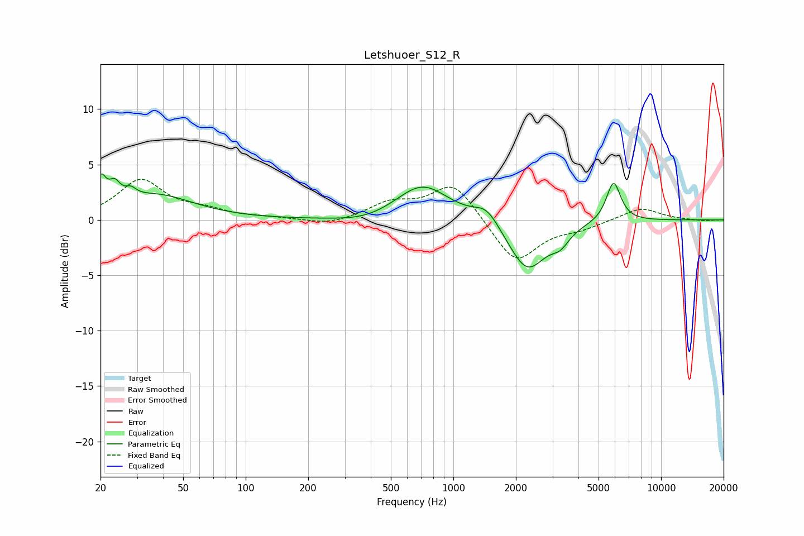

# Letshuoer_S12_R
See [usage instructions](https://github.com/jaakkopasanen/AutoEq#usage) for more options and info.

### Parametric EQs
Apply preamp of -4.2 dB when using parametric equalizer.

|   # | Type    |   Fc (Hz) |    Q |   Gain (dB) |
|-----|---------|-----------|------|-------------|
|   1 | Peaking |        20 | 5.59 |         2.6 |
|   2 | Peaking |        23 | 5.13 |         1.5 |
|   3 | Peaking |        28 | 5.51 |         0.7 |
|   4 | Peaking |        37 | 0.77 |         2.2 |
|   5 | Peaking |       380 | 1.04 |        -0.5 |
|   6 | Peaking |       710 | 1.11 |         3.2 |
|   7 | Peaking |      1447 | 2.31 |         1.5 |
|   8 | Peaking |      2268 | 1.55 |        -4.6 |
|   9 | Peaking |      3269 | 3.28 |        -1.2 |
|  10 | Peaking |      5904 | 3.98 |         3.6 |

### Fixed Band EQs
When using fixed band (also called graphic) equalizer, apply preamp of **-3.8 dB** (if available) and set gains manually with these parameters.

|   # | Type    |   Fc (Hz) |    Q |   Gain (dB) |
|-----|---------|-----------|------|-------------|
|   1 | Peaking |        31 | 1.41 |         3.5 |
|   2 | Peaking |        62 | 1.41 |         0.7 |
|   3 | Peaking |       125 | 1.41 |         0.1 |
|   4 | Peaking |       250 | 1.41 |        -0.5 |
|   5 | Peaking |       500 | 1.41 |         1.4 |
|   6 | Peaking |      1000 | 1.41 |         3.4 |
|   7 | Peaking |      2000 | 1.41 |        -4   |
|   8 | Peaking |      4000 | 1.41 |        -0.7 |
|   9 | Peaking |      8000 | 1.41 |         1.1 |
|  10 | Peaking |     16000 | 1.41 |        -0.1 |

### Graphs

