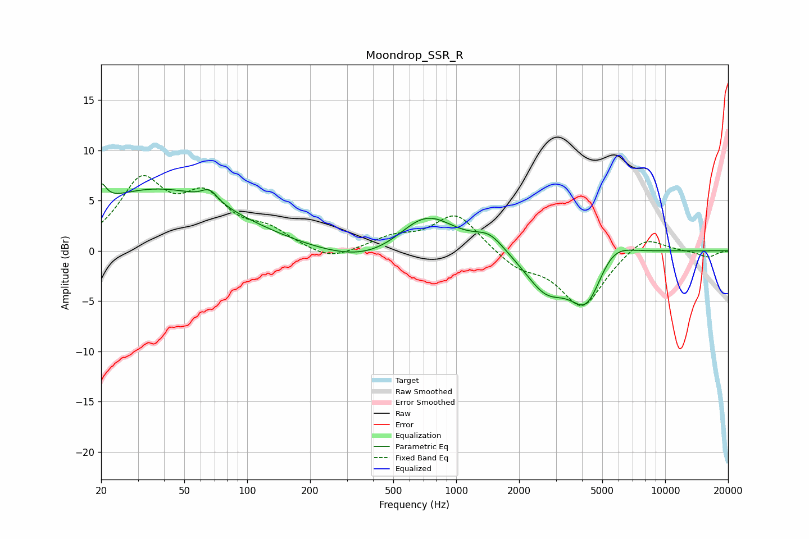

# Moondrop_SSR_R
See [usage instructions](https://github.com/jaakkopasanen/AutoEq#usage) for more options and info.

### Parametric EQs
Apply preamp of -6.8 dB when using parametric equalizer.

|   # | Type    |   Fc (Hz) |    Q |   Gain (dB) |
|-----|---------|-----------|------|-------------|
|   1 | Peaking |        20 | 5.98 |         1.9 |
|   2 | Peaking |        37 | 0.39 |         6.1 |
|   3 | Peaking |        66 | 3.77 |         1.2 |
|   4 | Peaking |       406 | 0.62 |        -1.9 |
|   5 | Peaking |       715 | 0.99 |         4.3 |
|   6 | Peaking |      1444 | 1.98 |         1.6 |
|   7 | Peaking |      2687 | 1.42 |        -3.7 |
|   8 | Peaking |      4224 | 1.72 |        -5.3 |
|   9 | Peaking |      5505 | 1.51 |         2.3 |
|  10 | Peaking |      9864 | 1.53 |         0.1 |

### Fixed Band EQs
When using fixed band (also called graphic) equalizer, apply preamp of **-7.6 dB** (if available) and set gains manually with these parameters.

|   # | Type    |   Fc (Hz) |    Q |   Gain (dB) |
|-----|---------|-----------|------|-------------|
|   1 | Peaking |        31 | 1.41 |         6.5 |
|   2 | Peaking |        62 | 1.41 |         4.7 |
|   3 | Peaking |       125 | 1.41 |         1.7 |
|   4 | Peaking |       250 | 1.41 |        -1.1 |
|   5 | Peaking |       500 | 1.41 |         1.2 |
|   6 | Peaking |      1000 | 1.41 |         3.7 |
|   7 | Peaking |      2000 | 1.41 |        -1.6 |
|   8 | Peaking |      4000 | 1.41 |        -5.5 |
|   9 | Peaking |      8000 | 1.41 |         1.7 |
|  10 | Peaking |     16000 | 1.41 |        -0.6 |

### Graphs

