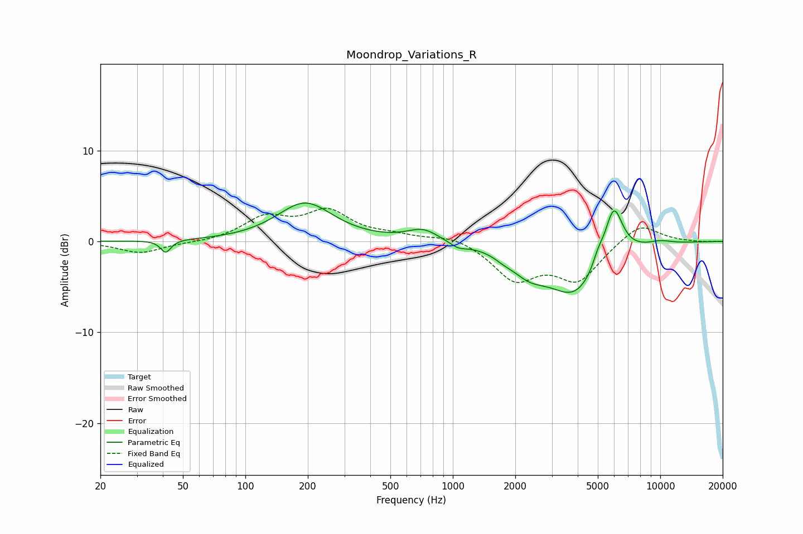

# Moondrop_Variations_R
See [usage instructions](https://github.com/jaakkopasanen/AutoEq#usage) for more options and info.

### Parametric EQs
Apply preamp of -4.3 dB when using parametric equalizer.

|   # | Type    |   Fc (Hz) |    Q |   Gain (dB) |
|-----|---------|-----------|------|-------------|
|   1 | Peaking |        41 | 5.92 |        -1.4 |
|   2 | Peaking |       194 | 1.06 |         4.2 |
|   3 | Peaking |       718 | 1.87 |         1.3 |
|   4 | Peaking |      1063 | 3.44 |        -0.6 |
|   5 | Peaking |      1762 | 3.13 |        -0.4 |
|   6 | Peaking |      2325 | 1.64 |        -2.2 |
|   7 | Peaking |      3890 | 1.06 |        -5.7 |
|   8 | Peaking |      5009 | 5.28 |         1.1 |
|   9 | Peaking |      5959 | 3.09 |         6   |
|  10 | Peaking |      9932 | 2.05 |         0.4 |

### Fixed Band EQs
When using fixed band (also called graphic) equalizer, apply preamp of **-3.7 dB** (if available) and set gains manually with these parameters.

|   # | Type    |   Fc (Hz) |    Q |   Gain (dB) |
|-----|---------|-----------|------|-------------|
|   1 | Peaking |        31 | 1.41 |        -1.3 |
|   2 | Peaking |        62 | 1.41 |        -0.2 |
|   3 | Peaking |       125 | 1.41 |         2.5 |
|   4 | Peaking |       250 | 1.41 |         3.1 |
|   5 | Peaking |       500 | 1.41 |         0.5 |
|   6 | Peaking |      1000 | 1.41 |         0.7 |
|   7 | Peaking |      2000 | 1.41 |        -4   |
|   8 | Peaking |      4000 | 1.41 |        -4.1 |
|   9 | Peaking |      8000 | 1.41 |         2.1 |
|  10 | Peaking |     16000 | 1.41 |        -0.1 |

### Graphs

