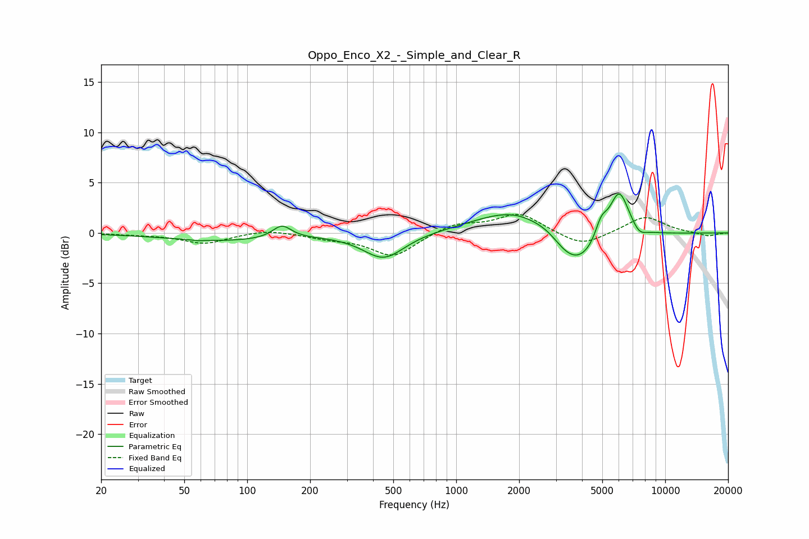

# Oppo_Enco_X2_-_Simple_and_Clear_R
See [usage instructions](https://github.com/jaakkopasanen/AutoEq#usage) for more options and info.

### Parametric EQs
Apply preamp of -4.0 dB when using parametric equalizer.

|   # | Type    |   Fc (Hz) |    Q |   Gain (dB) |
|-----|---------|-----------|------|-------------|
|   1 | Peaking |        58 | 5.19 |        -0.1 |
|   2 | Peaking |        77 | 0.51 |        -0.8 |
|   3 | Peaking |       147 | 3.17 |         1.3 |
|   4 | Peaking |       451 | 1.43 |        -2.6 |
|   5 | Peaking |      2013 | 0.73 |         2.9 |
|   6 | Peaking |      2778 | 2.08 |         0.7 |
|   7 | Peaking |      3693 | 1.07 |        -4.6 |
|   8 | Peaking |      4938 | 4.67 |         1.9 |
|   9 | Peaking |      6015 | 2.79 |         5   |
|  10 | Peaking |      7518 | 4.13 |        -0.7 |

### Fixed Band EQs
When using fixed band (also called graphic) equalizer, apply preamp of **-1.9 dB** (if available) and set gains manually with these parameters.

|   # | Type    |   Fc (Hz) |    Q |   Gain (dB) |
|-----|---------|-----------|------|-------------|
|   1 | Peaking |        31 | 1.41 |        -0.1 |
|   2 | Peaking |        62 | 1.41 |        -1   |
|   3 | Peaking |       125 | 1.41 |         0.4 |
|   4 | Peaking |       250 | 1.41 |        -0.5 |
|   5 | Peaking |       500 | 1.41 |        -2.3 |
|   6 | Peaking |      1000 | 1.41 |         1   |
|   7 | Peaking |      2000 | 1.41 |         1.9 |
|   8 | Peaking |      4000 | 1.41 |        -1.4 |
|   9 | Peaking |      8000 | 1.41 |         1.7 |
|  10 | Peaking |     16000 | 1.41 |        -0.3 |

### Graphs

