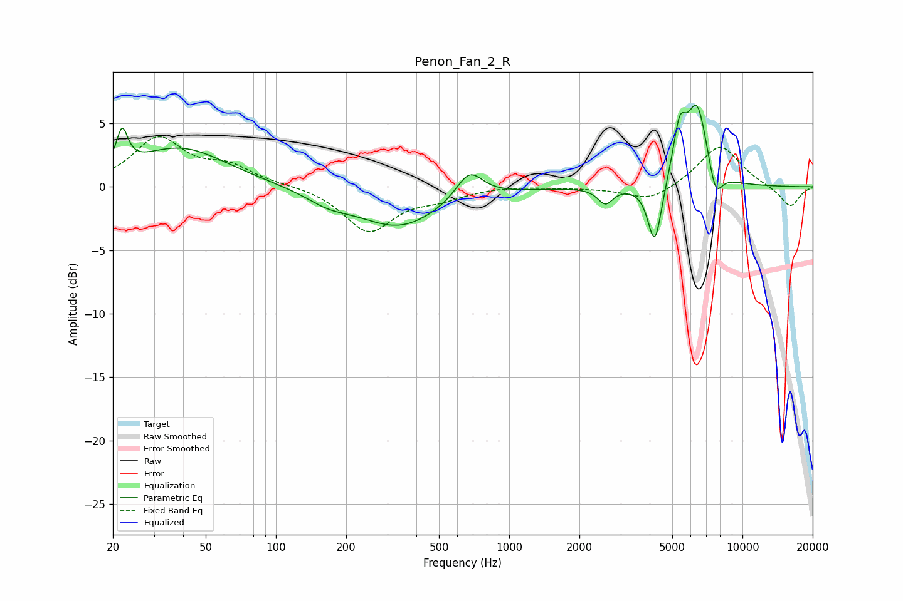

# Penon_Fan_2_R
See [usage instructions](https://github.com/jaakkopasanen/AutoEq#usage) for more options and info.

### Parametric EQs
Apply preamp of -6.5 dB when using parametric equalizer.

|   # | Type    |   Fc (Hz) |    Q |   Gain (dB) |
|-----|---------|-----------|------|-------------|
|   1 | Peaking |        22 | 5.99 |         2.9 |
|   2 | Peaking |        39 | 0.71 |         3.1 |
|   3 | Peaking |       167 | 1.5  |        -0.8 |
|   4 | Peaking |       338 | 0.78 |        -3.1 |
|   5 | Peaking |       675 | 2.47 |         2.3 |
|   6 | Peaking |      2585 | 4.36 |        -1.3 |
|   7 | Peaking |      4209 | 4.72 |        -5   |
|   8 | Peaking |      5374 | 4.97 |         3.8 |
|   9 | Peaking |      6392 | 3    |         6.3 |
|  10 | Peaking |      7660 | 4.61 |        -2.4 |

### Fixed Band EQs
When using fixed band (also called graphic) equalizer, apply preamp of **-4.1 dB** (if available) and set gains manually with these parameters.

|   # | Type    |   Fc (Hz) |    Q |   Gain (dB) |
|-----|---------|-----------|------|-------------|
|   1 | Peaking |        31 | 1.41 |         3.7 |
|   2 | Peaking |        62 | 1.41 |         1.4 |
|   3 | Peaking |       125 | 1.41 |         0.1 |
|   4 | Peaking |       250 | 1.41 |        -3.5 |
|   5 | Peaking |       500 | 1.41 |        -0.7 |
|   6 | Peaking |      1000 | 1.41 |         0.1 |
|   7 | Peaking |      2000 | 1.41 |        -0.1 |
|   8 | Peaking |      4000 | 1.41 |        -1.2 |
|   9 | Peaking |      8000 | 1.41 |         3.4 |
|  10 | Peaking |     16000 | 1.41 |        -1.6 |

### Graphs

