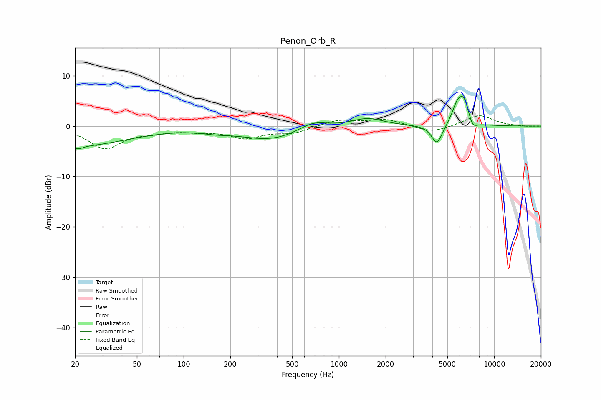

# Penon_Orb_R
See [usage instructions](https://github.com/jaakkopasanen/AutoEq#usage) for more options and info.

### Parametric EQs
Apply preamp of -6.0 dB when using parametric equalizer.

|   # | Type    |   Fc (Hz) |    Q |   Gain (dB) |
|-----|---------|-----------|------|-------------|
|   1 | Peaking |        20 | 0.42 |        -3.9 |
|   2 | Peaking |        21 | 5.11 |        -0.6 |
|   3 | Peaking |       161 | 1.49 |        -0.5 |
|   4 | Peaking |       366 | 0.72 |        -2.7 |
|   5 | Peaking |       679 | 1.54 |         1.7 |
|   6 | Peaking |      1527 | 1.39 |         1.6 |
|   7 | Peaking |      4281 | 4.06 |        -3.9 |
|   8 | Peaking |      5786 | 4    |         3.5 |
|   9 | Peaking |      6408 | 4.07 |         4.6 |
|  10 | Peaking |      7243 | 4.59 |        -1.9 |

### Fixed Band EQs
When using fixed band (also called graphic) equalizer, apply preamp of **-2.1 dB** (if available) and set gains manually with these parameters.

|   # | Type    |   Fc (Hz) |    Q |   Gain (dB) |
|-----|---------|-----------|------|-------------|
|   1 | Peaking |        31 | 1.41 |        -4.3 |
|   2 | Peaking |        62 | 1.41 |        -0.9 |
|   3 | Peaking |       125 | 1.41 |        -0.7 |
|   4 | Peaking |       250 | 1.41 |        -2.2 |
|   5 | Peaking |       500 | 1.41 |        -1.3 |
|   6 | Peaking |      1000 | 1.41 |         1.2 |
|   7 | Peaking |      2000 | 1.41 |         1.3 |
|   8 | Peaking |      4000 | 1.41 |        -1.4 |
|   9 | Peaking |      8000 | 1.41 |         2.2 |
|  10 | Peaking |     16000 | 1.41 |        -0.1 |

### Graphs

