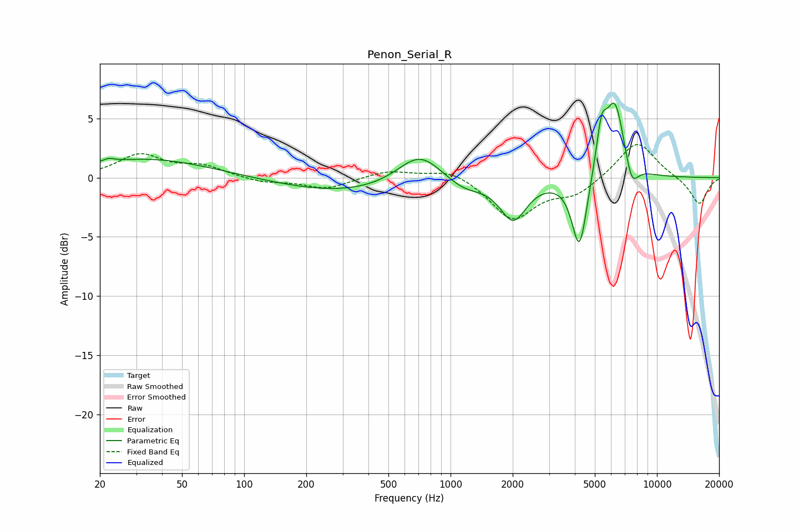

# Penon_Serial_R
See [usage instructions](https://github.com/jaakkopasanen/AutoEq#usage) for more options and info.

### Parametric EQs
Apply preamp of -6.4 dB when using parametric equalizer.

|   # | Type    |   Fc (Hz) |    Q |   Gain (dB) |
|-----|---------|-----------|------|-------------|
|   1 | Peaking |        22 | 5.79 |         0.3 |
|   2 | Peaking |        34 | 0.45 |         1.6 |
|   3 | Peaking |       312 | 0.44 |        -1.3 |
|   4 | Peaking |       708 | 1.32 |         2.7 |
|   5 | Peaking |      1161 | 1.59 |        -0.9 |
|   6 | Peaking |      2013 | 2.2  |        -3.4 |
|   7 | Peaking |      4212 | 3.83 |        -6.3 |
|   8 | Peaking |      5385 | 5.38 |         3.5 |
|   9 | Peaking |      6255 | 2.91 |         6.5 |
|  10 | Peaking |      7540 | 4.31 |        -2.2 |

### Fixed Band EQs
When using fixed band (also called graphic) equalizer, apply preamp of **-2.9 dB** (if available) and set gains manually with these parameters.

|   # | Type    |   Fc (Hz) |    Q |   Gain (dB) |
|-----|---------|-----------|------|-------------|
|   1 | Peaking |        31 | 1.41 |         1.9 |
|   2 | Peaking |        62 | 1.41 |         0.9 |
|   3 | Peaking |       125 | 1.41 |        -0.4 |
|   4 | Peaking |       250 | 1.41 |        -0.9 |
|   5 | Peaking |       500 | 1.41 |         0.6 |
|   6 | Peaking |      1000 | 1.41 |         0.8 |
|   7 | Peaking |      2000 | 1.41 |        -3.5 |
|   8 | Peaking |      4000 | 1.41 |        -1.3 |
|   9 | Peaking |      8000 | 1.41 |         3.2 |
|  10 | Peaking |     16000 | 1.41 |        -2.3 |

### Graphs

