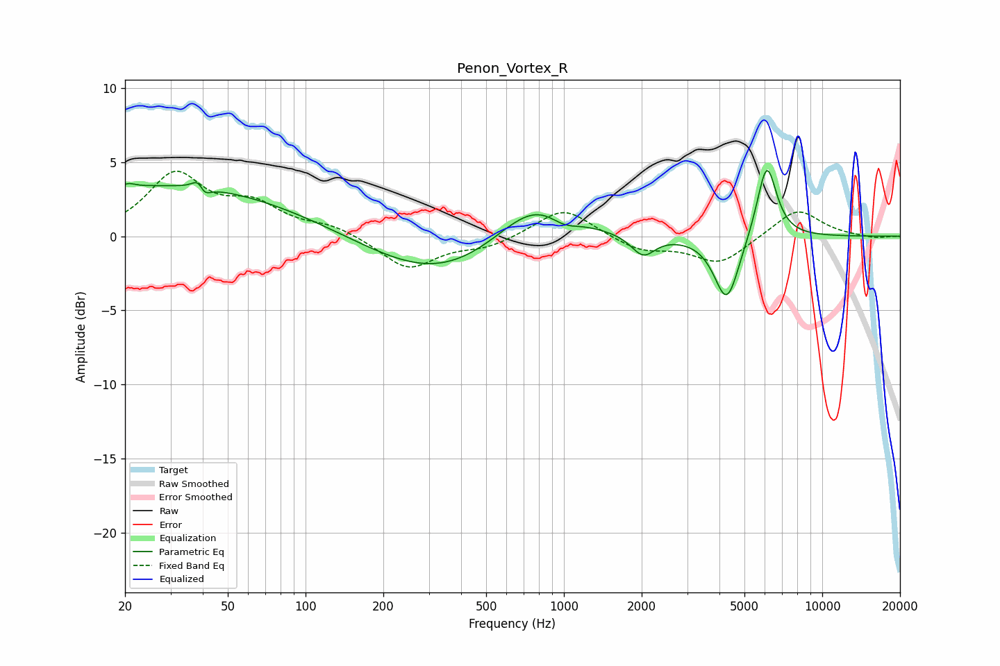

# Penon_Vortex_R
See [usage instructions](https://github.com/jaakkopasanen/AutoEq#usage) for more options and info.

### Parametric EQs
Apply preamp of -4.5 dB when using parametric equalizer.

|   # | Type    |   Fc (Hz) |    Q |   Gain (dB) |
|-----|---------|-----------|------|-------------|
|   1 | Peaking |        21 | 5.8  |         0.3 |
|   2 | Peaking |        29 | 0.27 |         3.4 |
|   3 | Peaking |        39 | 5.91 |         2.3 |
|   4 | Peaking |        40 | 5.93 |        -2.2 |
|   5 | Peaking |       330 | 0.53 |        -2.9 |
|   6 | Peaking |       778 | 0.92 |         3.1 |
|   7 | Peaking |      1001 | 2.42 |        -0.8 |
|   8 | Peaking |      2026 | 3.09 |        -1.4 |
|   9 | Peaking |      4274 | 2.88 |        -4.5 |
|  10 | Peaking |      6097 | 3.55 |         5.2 |

### Fixed Band EQs
When using fixed band (also called graphic) equalizer, apply preamp of **-4.5 dB** (if available) and set gains manually with these parameters.

|   # | Type    |   Fc (Hz) |    Q |   Gain (dB) |
|-----|---------|-----------|------|-------------|
|   1 | Peaking |        31 | 1.41 |         4   |
|   2 | Peaking |        62 | 1.41 |         1.9 |
|   3 | Peaking |       125 | 1.41 |         0.6 |
|   4 | Peaking |       250 | 1.41 |        -2.2 |
|   5 | Peaking |       500 | 1.41 |        -0.7 |
|   6 | Peaking |      1000 | 1.41 |         2   |
|   7 | Peaking |      2000 | 1.41 |        -0.9 |
|   8 | Peaking |      4000 | 1.41 |        -1.8 |
|   9 | Peaking |      8000 | 1.41 |         1.9 |
|  10 | Peaking |     16000 | 1.41 |        -0.2 |

### Graphs

