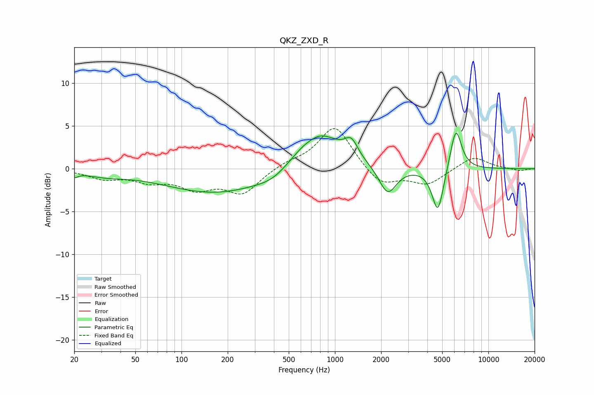

# QKZ_ZXD_R
See [usage instructions](https://github.com/jaakkopasanen/AutoEq#usage) for more options and info.

### Parametric EQs
Apply preamp of -4.2 dB when using parametric equalizer.

|   # | Type    |   Fc (Hz) |    Q |   Gain (dB) |
|-----|---------|-----------|------|-------------|
|   1 | Peaking |        20 | 5.78 |        -0.5 |
|   2 | Peaking |        32 | 1.07 |        -0.6 |
|   3 | Peaking |       172 | 0.41 |        -2.9 |
|   4 | Peaking |       398 | 1.34 |        -0.9 |
|   5 | Peaking |       694 | 3.24 |        -0.2 |
|   6 | Peaking |       762 | 0.93 |         4.7 |
|   7 | Peaking |      1278 | 3.27 |         1.9 |
|   8 | Peaking |      2206 | 2.49 |        -3.3 |
|   9 | Peaking |      4684 | 3.71 |        -5.3 |
|  10 | Peaking |      6134 | 3.7  |         5.1 |

### Fixed Band EQs
When using fixed band (also called graphic) equalizer, apply preamp of **-4.8 dB** (if available) and set gains manually with these parameters.

|   # | Type    |   Fc (Hz) |    Q |   Gain (dB) |
|-----|---------|-----------|------|-------------|
|   1 | Peaking |        31 | 1.41 |        -1   |
|   2 | Peaking |        62 | 1.41 |        -1.2 |
|   3 | Peaking |       125 | 1.41 |        -2   |
|   4 | Peaking |       250 | 1.41 |        -2.8 |
|   5 | Peaking |       500 | 1.41 |         0.6 |
|   6 | Peaking |      1000 | 1.41 |         5.1 |
|   7 | Peaking |      2000 | 1.41 |        -2.1 |
|   8 | Peaking |      4000 | 1.41 |        -1.8 |
|   9 | Peaking |      8000 | 1.41 |         1.5 |
|  10 | Peaking |     16000 | 1.41 |        -0.3 |

### Graphs

