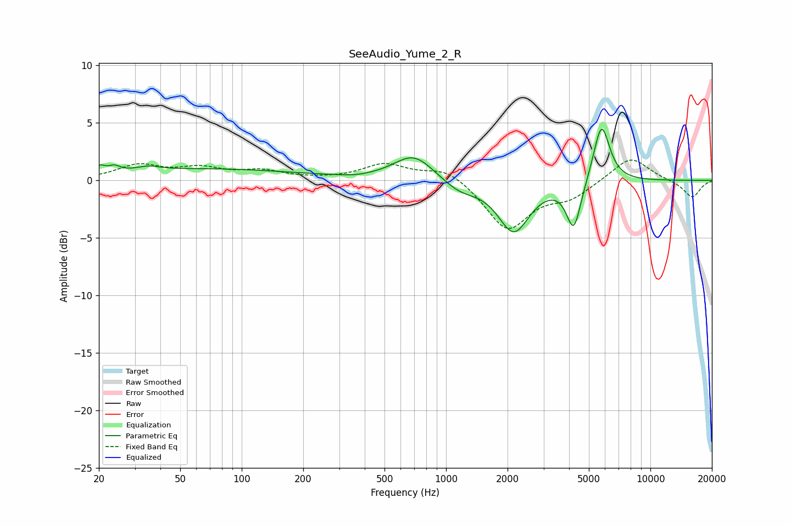

# SeeAudio_Yume_2_R
See [usage instructions](https://github.com/jaakkopasanen/AutoEq#usage) for more options and info.

### Parametric EQs
Apply preamp of -4.5 dB when using parametric equalizer.

|   # | Type    |   Fc (Hz) |    Q |   Gain (dB) |
|-----|---------|-----------|------|-------------|
|   1 | Peaking |        20 | 5.69 |         0.6 |
|   2 | Peaking |        24 | 4.7  |         0.5 |
|   3 | Peaking |        35 | 2.42 |         0.4 |
|   4 | Peaking |        68 | 0.32 |         1   |
|   5 | Peaking |       359 | 2.29 |        -0.1 |
|   6 | Peaking |       695 | 1.44 |         2.3 |
|   7 | Peaking |      1166 | 1.67 |        -1   |
|   8 | Peaking |      2145 | 1.84 |        -4.4 |
|   9 | Peaking |      4218 | 3.93 |        -4.2 |
|  10 | Peaking |      5762 | 3.46 |         5.2 |

### Fixed Band EQs
When using fixed band (also called graphic) equalizer, apply preamp of **-1.9 dB** (if available) and set gains manually with these parameters.

|   # | Type    |   Fc (Hz) |    Q |   Gain (dB) |
|-----|---------|-----------|------|-------------|
|   1 | Peaking |        31 | 1.41 |         1.2 |
|   2 | Peaking |        62 | 1.41 |         0.9 |
|   3 | Peaking |       125 | 1.41 |         0.7 |
|   4 | Peaking |       250 | 1.41 |         0   |
|   5 | Peaking |       500 | 1.41 |         1.4 |
|   6 | Peaking |      1000 | 1.41 |         1.1 |
|   7 | Peaking |      2000 | 1.41 |        -4.2 |
|   8 | Peaking |      4000 | 1.41 |        -1.3 |
|   9 | Peaking |      8000 | 1.41 |         2.1 |
|  10 | Peaking |     16000 | 1.41 |        -1.5 |

### Graphs

