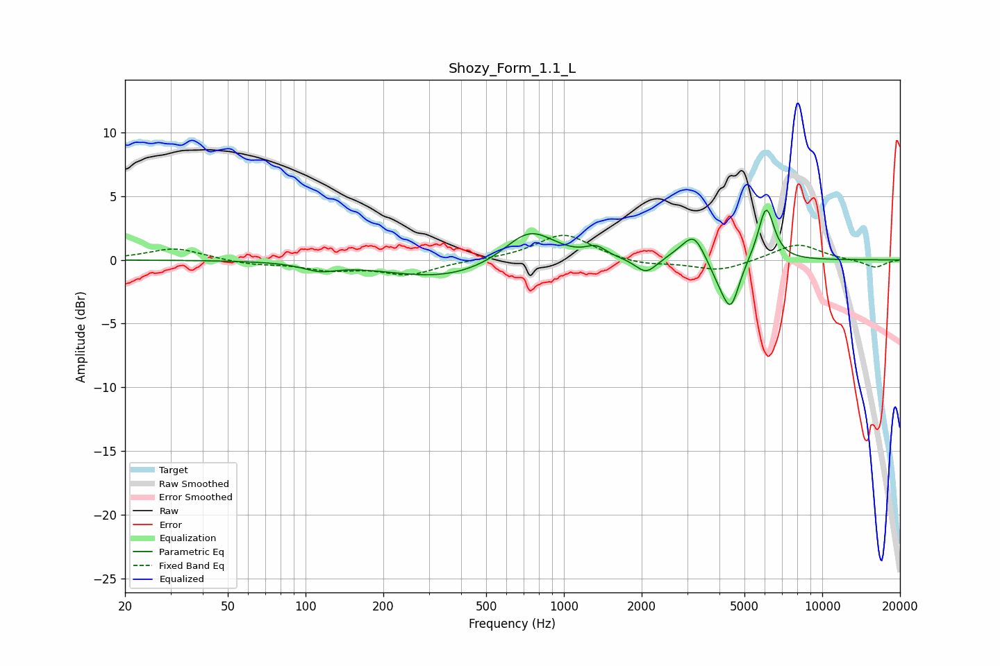

# Shozy_Form_1.1_L
See [usage instructions](https://github.com/jaakkopasanen/AutoEq#usage) for more options and info.

### Parametric EQs
Apply preamp of -4.0 dB when using parametric equalizer.

|   # | Type    |   Fc (Hz) |    Q |   Gain (dB) |
|-----|---------|-----------|------|-------------|
|   1 | Peaking |       113 | 2.22 |        -0.6 |
|   2 | Peaking |       347 | 0.62 |        -1.5 |
|   3 | Peaking |       736 | 1.43 |         2.7 |
|   4 | Peaking |      1332 | 3.58 |         0.8 |
|   5 | Peaking |      2082 | 3.43 |        -1.2 |
|   6 | Peaking |      2897 | 2.47 |         0.5 |
|   7 | Peaking |      3198 | 3.56 |         1.8 |
|   8 | Peaking |      4019 | 3.31 |        -1.2 |
|   9 | Peaking |      4432 | 4.22 |        -3.4 |
|  10 | Peaking |      6067 | 4.43 |         4.3 |

### Fixed Band EQs
When using fixed band (also called graphic) equalizer, apply preamp of **-2.0 dB** (if available) and set gains manually with these parameters.

|   # | Type    |   Fc (Hz) |    Q |   Gain (dB) |
|-----|---------|-----------|------|-------------|
|   1 | Peaking |        31 | 1.41 |         0.9 |
|   2 | Peaking |        62 | 1.41 |        -0.3 |
|   3 | Peaking |       125 | 1.41 |        -0.7 |
|   4 | Peaking |       250 | 1.41 |        -1.1 |
|   5 | Peaking |       500 | 1.41 |         0   |
|   6 | Peaking |      1000 | 1.41 |         2.1 |
|   7 | Peaking |      2000 | 1.41 |        -0.4 |
|   8 | Peaking |      4000 | 1.41 |        -0.9 |
|   9 | Peaking |      8000 | 1.41 |         1.3 |
|  10 | Peaking |     16000 | 1.41 |        -0.6 |

### Graphs

