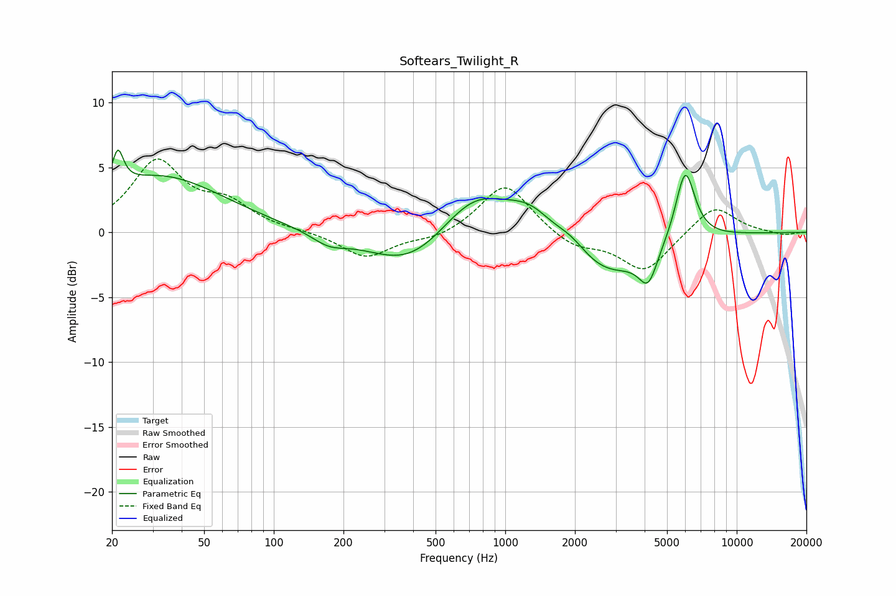

# Softears_Twilight_R
See [usage instructions](https://github.com/jaakkopasanen/AutoEq#usage) for more options and info.

### Parametric EQs
Apply preamp of -6.4 dB when using parametric equalizer.

|   # | Type    |   Fc (Hz) |    Q |   Gain (dB) |
|-----|---------|-----------|------|-------------|
|   1 | Peaking |        21 | 6    |         2.8 |
|   2 | Peaking |        32 | 0.51 |         4.3 |
|   3 | Peaking |       173 | 1.94 |        -0.8 |
|   4 | Peaking |       395 | 0.76 |        -3.1 |
|   5 | Peaking |       734 | 0.89 |         3.8 |
|   6 | Peaking |      1281 | 1.45 |         1.8 |
|   7 | Peaking |      1933 | 1.98 |         1   |
|   8 | Peaking |      2723 | 0.81 |        -3.4 |
|   9 | Peaking |      4145 | 3.47 |        -2.6 |
|  10 | Peaking |      5991 | 3.22 |         5.6 |

### Fixed Band EQs
When using fixed band (also called graphic) equalizer, apply preamp of **-5.7 dB** (if available) and set gains manually with these parameters.

|   # | Type    |   Fc (Hz) |    Q |   Gain (dB) |
|-----|---------|-----------|------|-------------|
|   1 | Peaking |        31 | 1.41 |         5.3 |
|   2 | Peaking |        62 | 1.41 |         1.9 |
|   3 | Peaking |       125 | 1.41 |         0.1 |
|   4 | Peaking |       250 | 1.41 |        -2   |
|   5 | Peaking |       500 | 1.41 |        -0.5 |
|   6 | Peaking |      1000 | 1.41 |         3.9 |
|   7 | Peaking |      2000 | 1.41 |        -1.2 |
|   8 | Peaking |      4000 | 1.41 |        -3   |
|   9 | Peaking |      8000 | 1.41 |         2.2 |
|  10 | Peaking |     16000 | 1.41 |        -0.2 |

### Graphs

