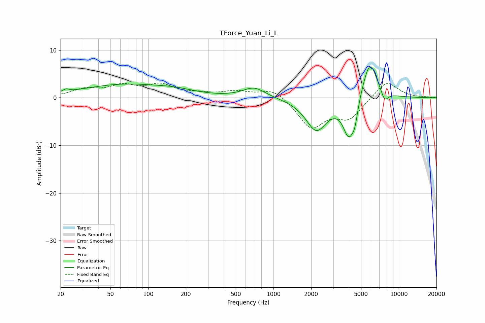

# TForce_Yuan_Li_L
See [usage instructions](https://github.com/jaakkopasanen/AutoEq#usage) for more options and info.

### Parametric EQs
Apply preamp of -6.6 dB when using parametric equalizer.

|   # | Type    |   Fc (Hz) |    Q |   Gain (dB) |
|-----|---------|-----------|------|-------------|
|   1 | Peaking |        22 | 5.96 |         0.6 |
|   2 | Peaking |        64 | 0.42 |         2.7 |
|   3 | Peaking |       167 | 0.96 |         0.7 |
|   4 | Peaking |       701 | 1.59 |         2.2 |
|   5 | Peaking |      2200 | 1.64 |        -6.7 |
|   6 | Peaking |      3991 | 6    |         1   |
|   7 | Peaking |      3997 | 3.23 |        -8.9 |
|   8 | Peaking |      4470 | 5.96 |        -3.1 |
|   9 | Peaking |      5870 | 2.25 |         8.5 |
|  10 | Peaking |      7693 | 4.26 |        -2.4 |

### Fixed Band EQs
When using fixed band (also called graphic) equalizer, apply preamp of **-3.2 dB** (if available) and set gains manually with these parameters.

|   # | Type    |   Fc (Hz) |    Q |   Gain (dB) |
|-----|---------|-----------|------|-------------|
|   1 | Peaking |        31 | 1.41 |         1.6 |
|   2 | Peaking |        62 | 1.41 |         2.2 |
|   3 | Peaking |       125 | 1.41 |         2.4 |
|   4 | Peaking |       250 | 1.41 |         0.7 |
|   5 | Peaking |       500 | 1.41 |         1.2 |
|   6 | Peaking |      1000 | 1.41 |         2.1 |
|   7 | Peaking |      2000 | 1.41 |        -6.2 |
|   8 | Peaking |      4000 | 1.41 |        -4.1 |
|   9 | Peaking |      8000 | 1.41 |         3.7 |
|  10 | Peaking |     16000 | 1.41 |         0.1 |

### Graphs

