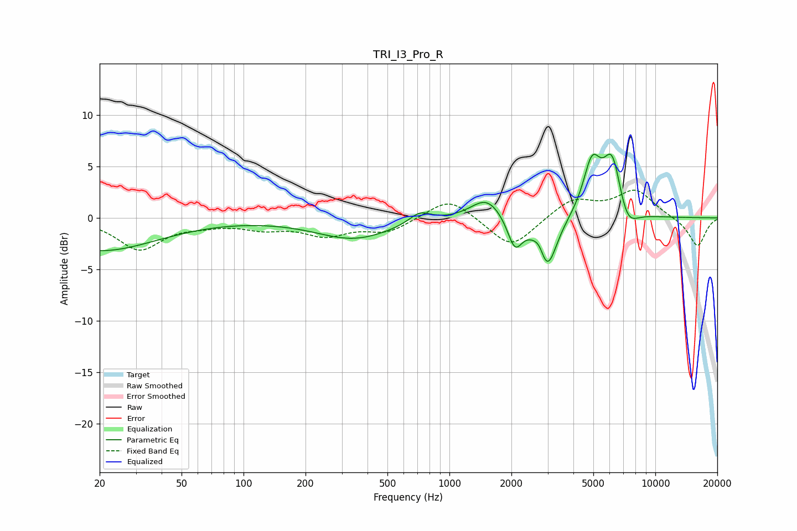

# TRI_I3_Pro_R
See [usage instructions](https://github.com/jaakkopasanen/AutoEq#usage) for more options and info.

### Parametric EQs
Apply preamp of -6.3 dB when using parametric equalizer.

|   # | Type    |   Fc (Hz) |    Q |   Gain (dB) |
|-----|---------|-----------|------|-------------|
|   1 | Peaking |        20 | 0.51 |        -3.2 |
|   2 | Peaking |       344 | 0.77 |        -2   |
|   3 | Peaking |       719 | 2.69 |         1.1 |
|   4 | Peaking |      1519 | 1.84 |         2.2 |
|   5 | Peaking |      2080 | 3.95 |        -3   |
|   6 | Peaking |      2752 | 4.96 |         1.5 |
|   7 | Peaking |      2962 | 2.95 |        -5.6 |
|   8 | Peaking |      4925 | 3.22 |         5   |
|   9 | Peaking |      6180 | 3.04 |         5.9 |
|  10 | Peaking |      7272 | 2.78 |        -2.3 |

### Fixed Band EQs
When using fixed band (also called graphic) equalizer, apply preamp of **-2.8 dB** (if available) and set gains manually with these parameters.

|   # | Type    |   Fc (Hz) |    Q |   Gain (dB) |
|-----|---------|-----------|------|-------------|
|   1 | Peaking |        31 | 1.41 |        -3   |
|   2 | Peaking |        62 | 1.41 |        -0.5 |
|   3 | Peaking |       125 | 1.41 |        -0.9 |
|   4 | Peaking |       250 | 1.41 |        -1.5 |
|   5 | Peaking |       500 | 1.41 |        -1.3 |
|   6 | Peaking |      1000 | 1.41 |         2.1 |
|   7 | Peaking |      2000 | 1.41 |        -3   |
|   8 | Peaking |      4000 | 1.41 |         1.8 |
|   9 | Peaking |      8000 | 1.41 |         2.6 |
|  10 | Peaking |     16000 | 1.41 |        -2.8 |

### Graphs

