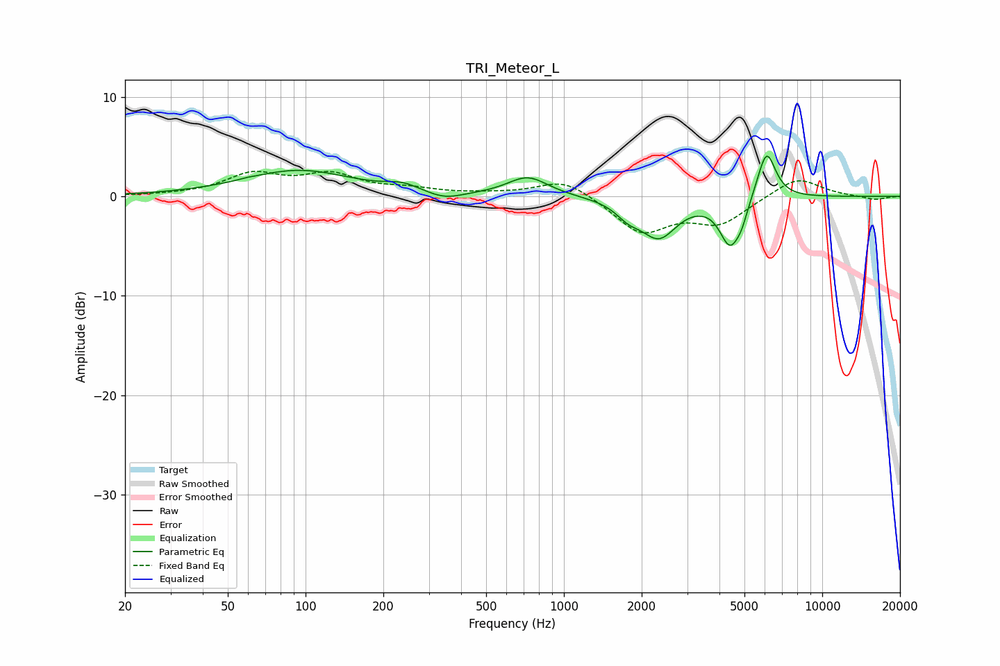

# TRI_Meteor_L
See [usage instructions](https://github.com/jaakkopasanen/AutoEq#usage) for more options and info.

### Parametric EQs
Apply preamp of -4.2 dB when using parametric equalizer.

|   # | Type    |   Fc (Hz) |    Q |   Gain (dB) |
|-----|---------|-----------|------|-------------|
|   1 | Peaking |        60 | 6    |         0.1 |
|   2 | Peaking |        94 | 0.68 |         2.6 |
|   3 | Peaking |       238 | 2.24 |         0.7 |
|   4 | Peaking |       345 | 2.07 |        -0.7 |
|   5 | Peaking |       724 | 1.81 |         2   |
|   6 | Peaking |      1774 | 2.96 |        -1.2 |
|   7 | Peaking |      2331 | 2.02 |        -3.9 |
|   8 | Peaking |      4396 | 3.49 |        -4.6 |
|   9 | Peaking |      4873 | 6    |        -1.3 |
|  10 | Peaking |      6086 | 3.87 |         5   |

### Fixed Band EQs
When using fixed band (also called graphic) equalizer, apply preamp of **-2.6 dB** (if available) and set gains manually with these parameters.

|   # | Type    |   Fc (Hz) |    Q |   Gain (dB) |
|-----|---------|-----------|------|-------------|
|   1 | Peaking |        31 | 1.41 |         0.1 |
|   2 | Peaking |        62 | 1.41 |         2.1 |
|   3 | Peaking |       125 | 1.41 |         2   |
|   4 | Peaking |       250 | 1.41 |         0.6 |
|   5 | Peaking |       500 | 1.41 |         0.2 |
|   6 | Peaking |      1000 | 1.41 |         1.8 |
|   7 | Peaking |      2000 | 1.41 |        -3.6 |
|   8 | Peaking |      4000 | 1.41 |        -2.6 |
|   9 | Peaking |      8000 | 1.41 |         2   |
|  10 | Peaking |     16000 | 1.41 |        -0.4 |

### Graphs

