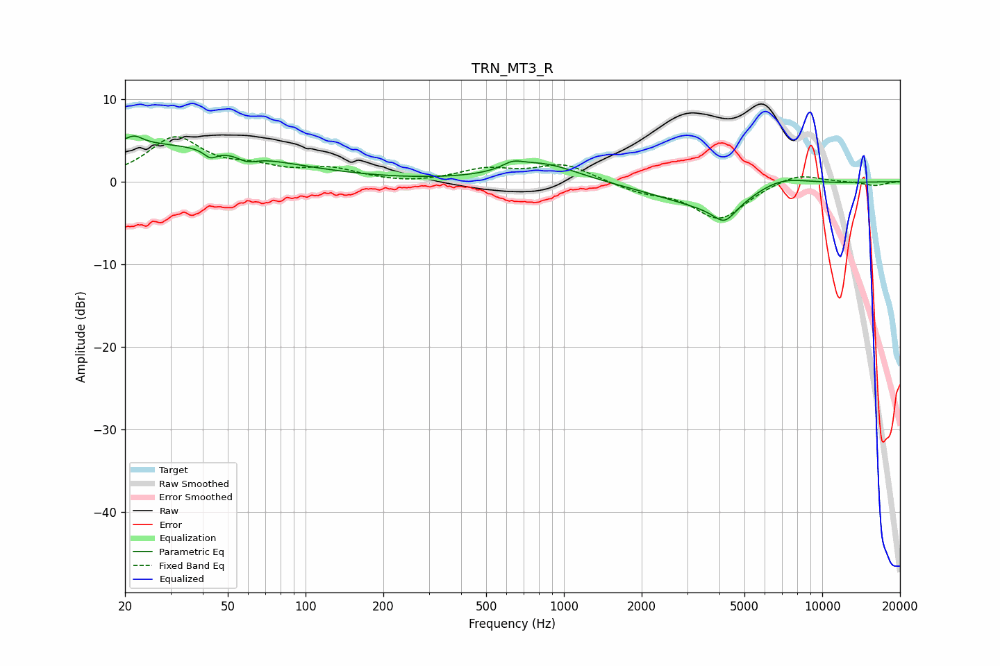

# TRN_MT3_R
See [usage instructions](https://github.com/jaakkopasanen/AutoEq#usage) for more options and info.

### Parametric EQs
Apply preamp of -5.6 dB when using parametric equalizer.

|   # | Type    |   Fc (Hz) |    Q |   Gain (dB) |
|-----|---------|-----------|------|-------------|
|   1 | Peaking |        20 | 0.25 |         4.6 |
|   2 | Peaking |        22 | 5.04 |         1.4 |
|   3 | Peaking |        22 | 5.86 |        -0.5 |
|   4 | Peaking |        43 | 5.82 |        -1   |
|   5 | Peaking |        60 | 3.84 |        -0.8 |
|   6 | Peaking |       633 | 3.53 |         0.8 |
|   7 | Peaking |       828 | 1.02 |         2.3 |
|   8 | Peaking |      3954 | 0.67 |        -3.4 |
|   9 | Peaking |      4188 | 3.18 |        -2.1 |
|  10 | Peaking |      6712 | 1.12 |         2   |

### Fixed Band EQs
When using fixed band (also called graphic) equalizer, apply preamp of **-5.5 dB** (if available) and set gains manually with these parameters.

|   # | Type    |   Fc (Hz) |    Q |   Gain (dB) |
|-----|---------|-----------|------|-------------|
|   1 | Peaking |        31 | 1.41 |         5.1 |
|   2 | Peaking |        62 | 1.41 |         1.3 |
|   3 | Peaking |       125 | 1.41 |         1.4 |
|   4 | Peaking |       250 | 1.41 |        -0.3 |
|   5 | Peaking |       500 | 1.41 |         1.4 |
|   6 | Peaking |      1000 | 1.41 |         2.1 |
|   7 | Peaking |      2000 | 1.41 |        -1.1 |
|   8 | Peaking |      4000 | 1.41 |        -4.5 |
|   9 | Peaking |      8000 | 1.41 |         1.2 |
|  10 | Peaking |     16000 | 1.41 |        -0.5 |

### Graphs

