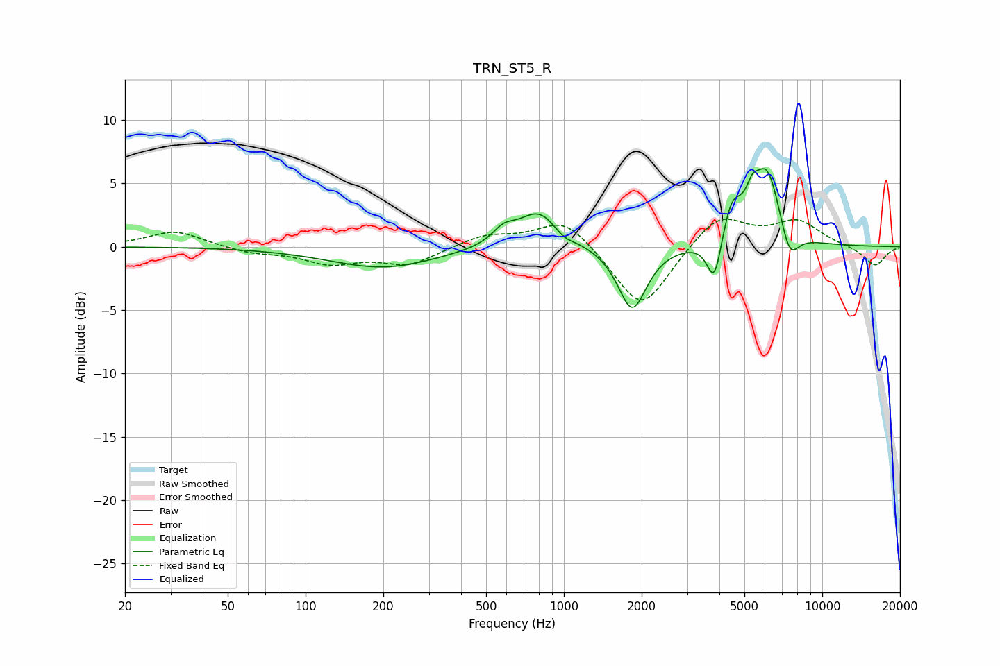

# TRN_ST5_R
See [usage instructions](https://github.com/jaakkopasanen/AutoEq#usage) for more options and info.

### Parametric EQs
Apply preamp of -6.3 dB when using parametric equalizer.

|   # | Type    |   Fc (Hz) |    Q |   Gain (dB) |
|-----|---------|-----------|------|-------------|
|   1 | Peaking |       200 | 0.68 |        -1.7 |
|   2 | Peaking |       583 | 3.35 |         1   |
|   3 | Peaking |       804 | 1.66 |         3   |
|   4 | Peaking |       992 | 3.46 |        -0.7 |
|   5 | Peaking |      1839 | 2.57 |        -5.1 |
|   6 | Peaking |      3829 | 4.9  |        -3.8 |
|   7 | Peaking |      4458 | 3.61 |         3   |
|   8 | Peaking |      5361 | 5.98 |         1.5 |
|   9 | Peaking |      6114 | 2.48 |         6.1 |
|  10 | Peaking |      7458 | 3.66 |        -2.7 |

### Fixed Band EQs
When using fixed band (also called graphic) equalizer, apply preamp of **-2.3 dB** (if available) and set gains manually with these parameters.

|   # | Type    |   Fc (Hz) |    Q |   Gain (dB) |
|-----|---------|-----------|------|-------------|
|   1 | Peaking |        31 | 1.41 |         1.3 |
|   2 | Peaking |        62 | 1.41 |        -0.5 |
|   3 | Peaking |       125 | 1.41 |        -1.2 |
|   4 | Peaking |       250 | 1.41 |        -1.4 |
|   5 | Peaking |       500 | 1.41 |         0.9 |
|   6 | Peaking |      1000 | 1.41 |         2.4 |
|   7 | Peaking |      2000 | 1.41 |        -5.1 |
|   8 | Peaking |      4000 | 1.41 |         2.6 |
|   9 | Peaking |      8000 | 1.41 |         1.9 |
|  10 | Peaking |     16000 | 1.41 |        -1.5 |

### Graphs

